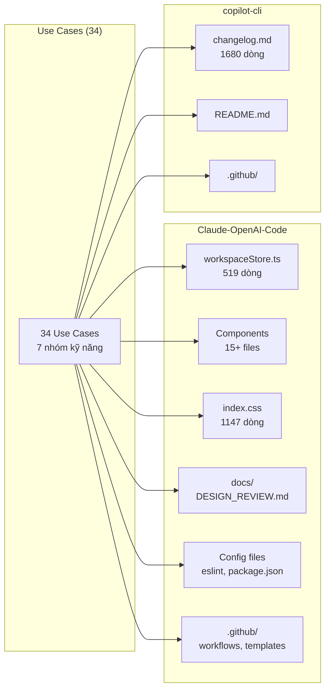
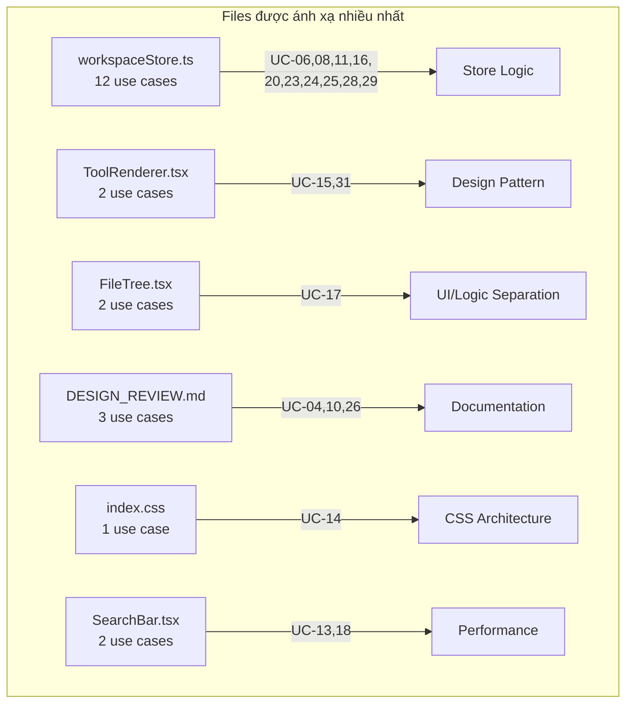
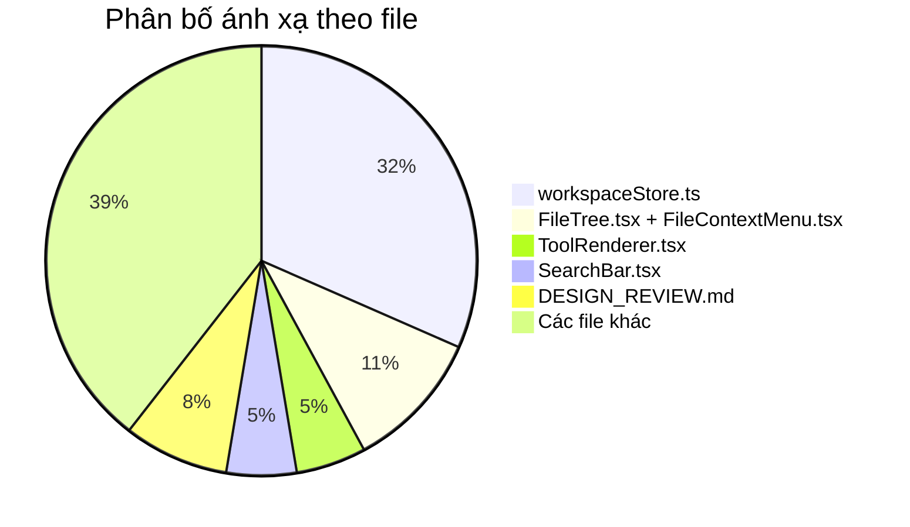

# Copilot Chat Use Cases - Ánh xạ mã nguồn

> Tài liệu ánh xạ chi tiết từng use case vào các phần mã nguồn cụ thể trong repo [ATC-O48/Claude-OpenAI-Code](https://github.com/ATC-O48/Claude-OpenAI-Code) và [ATC-O48/copilot-cli](https://github.com/ATC-O48/copilot-cli).

---

## Mục lục

- [Tổng quan ánh xạ](#tổng-quan-ánh-xạ)
- [Repo ATC-O48/Claude-OpenAI-Code](#repo-atc-o48claude-openai-code)
  - [1. Giao tiếp hiệu quả](#1-giao-tiếp-hiệu-quả)
  - [2. Gỡ lỗi mã](#2-gỡ-lỗi-mã)
  - [3. Phân tích chức năng](#3-phân-tích-chức-năng)
  - [4. Tái cấu trúc mã](#4-tái-cấu-trúc-mã)
  - [5. Ghi chép mã nguồn](#5-ghi-chép-mã-nguồn)
  - [6. Kiểm thử mã](#6-kiểm-thử-mã)
  - [7. Phân tích an ninh](#7-phân-tích-an-ninh)
- [Repo ATC-O48/copilot-cli](#repo-atc-o48copilot-cli)
- [Sơ đồ ánh xạ tổng quan](#sơ-đồ-ánh-xạ-tổng-quan)
- [Tài liệu liên quan](#tài-liệu-liên-quan)

---

## Tổng quan ánh xạ

---

## Repo ATC-O48/Claude-OpenAI-Code

### 1. Giao tiếp hiệu quả

#### UC-01: Tạo mẫu (Generate Templates)

| Thuộc tính | Chi tiết |
|---|---|
| **File** | `README.md` |
| **Dòng** | 240-258 |
| **Chi tiết** | Contributing guidelines hiện tại cơ bản. Có thể tạo PR template, issue template chi tiết hơn, contributing guide đầy đủ cho dự án React/TypeScript IDE. |
| **Áp dụng thêm** | `.github/ISSUE_TEMPLATE/` — hiện chỉ có `ISSUE_TEMPLATE_GOOD_FIRST.md`, cần thêm bug report, feature request templates. |

#### UC-04: Tạo sơ đồ (Create Diagrams)

| Thuộc tính | Chi tiết |
|---|---|
| **File** | `docs/DESIGN_REVIEW.md` |
| **Dòng** | 1-129 |
| **Chi tiết** | Kiến trúc hiện tại mô tả bằng text. Cần Mermaid diagrams cho: component tree, data flow (FileTree → workspaceStore → EditorTool), layout rendering (recursive PaneSplit/Pane). |

#### UC-05: Tạo bảng (Create Tables)

| Thuộc tính | Chi tiết |
|---|---|
| **File** | `README.md` |
| **Dòng** | 136-147 |
| **Chi tiết** | Bảng tools hiện tại liệt kê 9 tools cơ bản. Có thể mở rộng bảng so sánh: tên tool, ToolType enum, có state riêng không, có kết nối store không, độ phức tạp UI. |

---

### 2. Gỡ lỗi mã

#### UC-06: Gỡ lỗi JSON không hợp lệ (Debug Invalid JSON)

| Thuộc tính | Chi tiết |
|---|---|
| **File** | `src/stores/workspaceStore.ts` |
| **Dòng** | 74-108 |
| **Chi tiết** | Sample files data hardcoded dưới dạng nested `FileNode` objects. Cần xác minh tất cả objects tuân thủ interface `FileNode` trong `src/types/workspace.ts` (id, name, type, children, content). |
| **Liên kết type** | `src/types/workspace.ts` dòng 1-22 — `FileNode` interface definition. |

#### UC-07: Xử lý giới hạn tỷ lệ truy cập API (Handle API Rate Limits)

| Thuộc tính | Chi tiết |
|---|---|
| **File** | `src/components/tools/AgentTool.tsx` |
| **Dòng** | 17-26 |
| **Chi tiết** | Agent hiện tại trả về mock response (`setTimeout` + hardcoded reply). Khi kết nối API thật, cần thêm: exponential backoff, retry sau HTTP 429, hiển thị loading/error state cho người dùng. |

#### UC-08: Chẩn đoán lỗi kiểm tra (Diagnose Test Failures)

| Thuộc tính | Chi tiết |
|---|---|
| **File** | `src/stores/workspaceStore.ts` |
| **Dòng** | 483-499 |
| **Chi tiết** | Hàm `duplicateFile` — kịch bản test failure: duplicate file ở root level (parentPath rỗng). Logic tìm parent node bằng `findFileNode(parentPath)` có thể trả về `null` khi path rỗng. |

---

### 3. Phân tích chức năng

#### UC-09: Khám phá phương án triển khai (Explore Feature Implementations)

| Thuộc tính | Chi tiết |
|---|---|
| **File** | `src/components/layout/PaneView.tsx` |
| **Dòng** | Toàn bộ file |
| **Chi tiết** | Triển khai drag-and-drop tab reordering. `@dnd-kit` đã có trong `package.json`. Có thể đề xuất 3 phương án: dnd-kit sortable, HTML5 native drag, custom pointer events. |
| **Dependencies** | `package.json` dòng 15 — `@dnd-kit/core`, `@dnd-kit/sortable` đã cài đặt. |

#### UC-10: Phân tích phản hồi người dùng (Analyze User Feedback)

| Thuộc tính | Chi tiết |
|---|---|
| **File** | `docs/DESIGN_REVIEW.md` |
| **Dòng** | 1-129 |
| **Chi tiết** | File chứa nhiều "Recommendations" và "Areas for Improvement". Cần tổng hợp thành danh sách ưu tiên theo impact/effort matrix: persistent state, undo/redo, plugin system, accessibility, performance. |

---

### 4. Tái cấu trúc mã

#### UC-11: Cải thiện khả năng đọc hiểu mã (Improve Code Readability)

| Thuộc tính | Chi tiết |
|---|---|
| **File** | `src/stores/workspaceStore.ts` |
| **Dòng** | 153-252 |
| **Chi tiết** | Các hàm đệ quy `findPaneAndUpdate` (dòng 153-184), `splitInLayout` (dòng 233-252), `updateFileNodes` (dòng 185-215) thiếu comments, tên biến callback parameters không rõ ràng (`cb`, `node`). Cần thêm JSDoc, đặt tên mô tả hơn, tách logic phức tạp. |

#### UC-12: Sửa lỗi lint (Fix Lint Errors)

| Thuộc tính | Chi tiết |
|---|---|
| **File** | `eslint.config.js` + `src/**/*.{ts,tsx}` |
| **Dòng** | — |
| **Chi tiết** | Chạy `npm run lint` để tìm tất cả lỗi và cảnh báo ESLint. Config sử dụng `@eslint/js`, `typescript-eslint`, `eslint-plugin-react-hooks`, `eslint-plugin-react-refresh`. |

#### UC-13: Tái cấu trúc hiệu năng (Refactor for Performance)

| Thuộc tính | Chi tiết |
|---|---|
| **File** | `src/components/search/SearchBar.tsx` |
| **Dòng** | 6-15, 47-94 |
| **Chi tiết** | `flattenFiles()` (dòng 6-15) chạy recursive traversal mỗi lần component render. Search results (dòng 47-94) tính lại không cần thiết. Cần: `useMemo` cho flattenFiles, `debounce` cho search input, virtualization cho danh sách dài. |

#### UC-14: Tái cấu trúc bền vững (Refactor for Sustainability)

| Thuộc tính | Chi tiết |
|---|---|
| **File** | `src/index.css` |
| **Dòng** | 1-1147 |
| **Chi tiết** | CSS monolith 1147 dòng chứa styles cho mọi component. Nên tách thành CSS modules hoặc Tailwind component classes. Giảm CSS không sử dụng, tối ưu specificity, nhóm theo component. |

#### UC-15: Tái cấu trúc mẫu thiết kế (Refactor to Design Pattern)

| Thuộc tính | Chi tiết |
|---|---|
| **File** | `src/components/tools/ToolRenderer.tsx` |
| **Dòng** | 17-44 |
| **Chi tiết** | Switch-case hardcoded cho 9 tool types (`editor`, `preview`, `console`, `shell`, `secrets`, `file-history`, `multiplayer`, `settings`, `agent`). Mỗi khi thêm tool mới phải sửa file này. Nên dùng Registry Pattern hoặc Strategy Pattern. |

#### UC-16: Tái cấu trúc lớp truy cập dữ liệu (Refactor Data Access Layers)

| Thuộc tính | Chi tiết |
|---|---|
| **File** | `src/stores/workspaceStore.ts` |
| **Dòng** | 254-519 |
| **Chi tiết** | Store 519 dòng chứa cả data access (`findFileNode`, `updateFileNodes`, `findPaneAndUpdate`) và business logic (`openFile`, `duplicateFile`, `createFile`). Cần tách thành: `fileSystemService.ts` cho data operations và `workspaceActions.ts` cho business logic. |

#### UC-17: Tách logic nghiệp vụ khỏi UI (Decouple Business Logic from UI)

**Ánh xạ 1:**

| Thuộc tính | Chi tiết |
|---|---|
| **File** | `src/components/filetree/FileTree.tsx` |
| **Dòng** | 75-187 |
| **Chi tiết** | Logic tạo file (`handleNewFile` dòng ~85, `handleCreateFile` dòng ~95) trộn lẫn với JSX rendering. Nên tách thành custom hook `useFileTreeActions()`. Component chỉ render UI, hook xử lý logic. |

**Ánh xạ 2:**

| Thuộc tính | Chi tiết |
|---|---|
| **File** | `src/components/filetree/FileContextMenu.tsx` |
| **Dòng** | 36-54 |
| **Chi tiết** | `handleRename` (dòng ~36) dùng `window.prompt()` trực tiếp trong component. `handleDownload` (dòng ~44) chứa logic tạo Blob và download link trong component. Cần tách ra utility functions. |

#### UC-18: Giải quyết vấn đề xuyên suốt (Address Cross-Cutting Concerns)

| Thuộc tính | Chi tiết |
|---|---|
| **File** | `src/components/layout/PaneOptionsMenu.tsx` |
| **Dòng** | 22-30 |
| **Chi tiết** | Click-outside detection logic lặp lại ở 3 component: `PaneOptionsMenu.tsx` (dòng 22-30), `FileContextMenu.tsx` (dòng 20-28), `SearchBar.tsx` (dòng 25-33). Mỗi nơi đều dùng `useEffect` + `addEventListener('mousedown')`. Cần tạo shared hook `useClickOutside()`. |
| **Files liên quan** | `src/components/filetree/FileContextMenu.tsx`, `src/components/search/SearchBar.tsx` |

#### UC-19: Đơn giản hóa kế thừa (Simplify Inheritance Hierarchies)

| Thuộc tính | Chi tiết |
|---|---|
| **File** | `src/types/workspace.ts` |
| **Dòng** | 24-45 |
| **Chi tiết** | Union type `Pane \| PaneSplit` lặp lại ở nhiều nơi: `workspace.ts`, `workspaceStore.ts`, `WorkspaceLayout.tsx`. Cần tạo type alias `LayoutNode = Pane \| PaneSplit` và hàm type guard `isPane()` / `isPaneSplit()` dùng chung. |
| **Files liên quan** | `src/stores/workspaceStore.ts`, `src/components/layout/WorkspaceLayout.tsx` |

#### UC-20: Khắc phục tắc nghẽn DB (Fix Database Bottlenecks)

| Thuộc tính | Chi tiết |
|---|---|
| **File** | `src/stores/workspaceStore.ts` |
| **Dòng** | Toàn bộ file |
| **Chi tiết** | Store hiện dùng in-memory state (Zustand). Nếu migrate sang IndexedDB/localStorage cho persistent file storage, cần giải quyết: non-blocking reads/writes, Web Worker cho file tree lớn, optimistic updates, sync strategy. |

#### UC-21: Dịch mã (Translate Code)

| Thuộc tính | Chi tiết |
|---|---|
| **File** | Toàn bộ `src/` |
| **Dòng** | — |
| **Chi tiết** | Dự án React/TypeScript có thể dịch sang Vue 3 (Composition API), Svelte, hoặc Angular. Ví dụ cụ thể: `AgentTool.tsx` (58 dòng) — component chat interface đơn giản, phù hợp để demo dịch framework. |

---

### 5. Ghi chép mã nguồn

#### UC-22: Tạo vấn đề (Create Issues)

| Thuộc tính | Chi tiết |
|---|---|
| **File** | `.github/` |
| **Dòng** | — |
| **Chi tiết** | Tạo GitHub issues dựa trên "Areas for Improvement" trong `DESIGN_REVIEW.md`: (1) Persistent state, (2) Undo/redo, (3) Plugin system, (4) Accessibility, (5) Performance optimization. Cần thêm issue templates cho bug report và feature request. |

#### UC-23: Ghi chép mã nguồn cũ (Document Legacy Code)

| Thuộc tính | Chi tiết |
|---|---|
| **File** | `src/stores/workspaceStore.ts` |
| **Dòng** | 254-519 |
| **Chi tiết** | Store có 519 dòng, 30+ actions, không có JSDoc documentation. Cần thêm: mô tả cho mỗi action, parameter types documentation, return value descriptions, usage examples. |

#### UC-24: Giải thích mã nguồn cũ (Explain Legacy Code)

| Thuộc tính | Chi tiết |
|---|---|
| **File** | `src/stores/workspaceStore.ts` |
| **Dòng** | 233-252 |
| **Chi tiết** | Hàm `splitInLayout` — đệ quy traverse cây layout, tìm pane target, tạo PaneSplit mới thay thế. Logic phức tạp do nested recursion + immutable state updates. |

#### UC-25: Giải thích thuật toán phức tạp (Explain Complex Algorithms)

**Ánh xạ 1:**

| Thuộc tính | Chi tiết |
|---|---|
| **File** | `src/components/layout/WorkspaceLayout.tsx` |
| **Dòng** | 17-52 |
| **Chi tiết** | Recursive `LayoutRenderer` component: traverse cây `PaneSplit`/`Pane`, render `ResizablePanelGroup` cho splits, `PaneView` cho leaf panes. Thuật toán DFS implicit trong React render tree. |

**Ánh xạ 2:**

| Thuộc tính | Chi tiết |
|---|---|
| **File** | `src/stores/workspaceStore.ts` |
| **Dòng** | 233-252 |
| **Chi tiết** | `splitInLayout` — đệ quy tìm pane bằng ID, thay thế bằng PaneSplit mới chứa pane gốc + pane mới. Xử lý cả trường hợp node là PaneSplit (đệ quy xuống children) và Pane (base case). |

#### UC-26: Đồng bộ tài liệu (Sync Documentation)

| Thuộc tính | Chi tiết |
|---|---|
| **File** | `docs/DESIGN_REVIEW.md` vs `src/` |
| **Dòng** | — |
| **Chi tiết** | Design review document có thể outdated so với code hiện tại. Cần so sánh: component list trong doc vs thực tế, API descriptions vs implementation, recommendations đã thực hiện chưa. |

#### UC-27: Viết bài blog/thảo luận (Write Blog Posts)

| Thuộc tính | Chi tiết |
|---|---|
| **File** | `src/components/layout/WorkspaceLayout.tsx`, `src/components/layout/PaneView.tsx` |
| **Dòng** | — |
| **Chi tiết** | Chủ đề blog: "Xây dựng recursive layout system cho browser-based IDE". Sử dụng code examples từ LayoutRenderer, PaneView, và react-resizable-panels integration. |

---

### 6. Kiểm thử mã

#### UC-28: Tạo bài kiểm tra đơn vị (Generate Unit Tests)

| Thuộc tính | Chi tiết |
|---|---|
| **File** | `src/stores/workspaceStore.ts` |
| **Dòng** | Toàn bộ file |
| **Chi tiết** | Không có test nào trong repo. Cần unit tests cho tất cả store actions: `addWindow`, `removeWindow`, `addTab`, `removeTab`, `splitPane`, `openFile`, `createFile`, `renameFile`, `deleteFile`, `duplicateFile`, và các helper functions. Sử dụng Vitest. |

#### UC-29: Tạo đối tượng giả (Create Mock Objects)

| Thuộc tính | Chi tiết |
|---|---|
| **File** | `src/stores/workspaceStore.ts` |
| **Dòng** | 254-519 |
| **Chi tiết** | Tạo mock factory cho Zustand store `useWorkspaceStore`. Mock data cần bao gồm: windows (với panes/tabs), files (nested FileNode tree), secrets (key-value pairs), resources (RAM/CPU/Storage). Dùng cho component testing. |

#### UC-30: Tạo kiểm tra E2E (Create E2E Tests)

| Thuộc tính | Chi tiết |
|---|---|
| **File** | `src/App.tsx` |
| **Dòng** | 11-49 |
| **Chi tiết** | App.tsx là entry point chính. E2E test flow: (1) Mở app → verify layout renders, (2) Click file trong FileTree → verify EditorTool hiển thị nội dung, (3) Split pane → verify 2 panes hiện ra, (4) Search file (Ctrl+K) → verify kết quả. Sử dụng Playwright. |
| **CI liên quan** | `.github/workflows/datadog-synthetics.yml` — đã có Datadog E2E config. |

#### UC-31: Cập nhật bài kiểm thử (Update Unit Tests)

| Thuộc tính | Chi tiết |
|---|---|
| **File** | — (chưa có tests) |
| **Dòng** | — |
| **Chi tiết** | Sau khi refactor ToolRenderer.tsx sang Registry Pattern (UC-15), cần cập nhật/tạo tests để cover: đăng ký tool mới vào registry, render đúng component cho từng ToolType, fallback cho unknown tool type, type safety. |

---

### 7. Phân tích an ninh

#### UC-32: Bảo mật kho lưu trữ (Secure Repository)

| Thuộc tính | Chi tiết |
|---|---|
| **File** | `.github/` |
| **Dòng** | — |
| **Chi tiết** | Thiếu các file bảo mật chuẩn: (1) `.github/dependabot.yml` — auto-update dependencies, (2) `SECURITY.md` — vulnerability reporting policy, (3) `CODEOWNERS` — code review assignments. Hiện chỉ có `Funding.yml` và 1 issue template. |

#### UC-33: Quản lý phụ thuộc (Manage Dependencies)

| Thuộc tính | Chi tiết |
|---|---|
| **File** | `package.json` |
| **Dòng** | 12-37 |
| **Chi tiết** | Dependencies cần kiểm tra: React 19, Zustand, Vite, Tailwind CSS v4, @dnd-kit, lucide-react, react-resizable-panels. DevDependencies: TypeScript, ESLint plugins. Cần Dependabot config cho automated vulnerability scanning. |

#### UC-34: Tìm lỗ hổng bảo mật (Find Security Vulnerabilities)

**Ánh xạ 1:**

| Thuộc tính | Chi tiết |
|---|---|
| **File** | `src/components/tools/SecretsTool.tsx` |
| **Dòng** | 39 |
| **Chi tiết** | Secrets hiển thị hardcoded string `'sk-abc123...xyz'` thay vì giá trị thật. Trong production, cần proper masking logic, secure storage, và không log/display secrets trong DevTools. |

**Ánh xạ 2:**

| Thuộc tính | Chi tiết |
|---|---|
| **File** | `src/components/filetree/FileContextMenu.tsx` |
| **Dòng** | 44-54 |
| **Chi tiết** | `handleDownload` tạo Blob từ `file.content` và trigger download không có sanitization. Nếu file content chứa malicious scripts, có thể dẫn đến XSS khi mở file đã download. |

**Ánh xạ 3:**

| Thuộc tính | Chi tiết |
|---|---|
| **File** | `src/components/spotlight/SpotlightPage.tsx` |
| **Dòng** | 17-21 |
| **Chi tiết** | `copyLink` function sử dụng `navigator.clipboard.writeText()` không có error handling. Clipboard API có thể fail do permissions, browser support, hoặc iframe restrictions. Cần try-catch và fallback. |

---

## Repo ATC-O48/copilot-cli

### UC-02: Trích xuất thông tin (Extract Information)

| Thuộc tính | Chi tiết |
|---|---|
| **File** | `changelog.md` |
| **Dòng** | Toàn bộ file (~1680 dòng) |
| **Chi tiết** | Changelog đồ sộ chứa lịch sử 36+ phiên bản. Cần trích xuất và phân loại: bug fixes, tính năng mới, cải thiện hiệu năng, breaking changes theo từng phiên bản. |

### UC-03: Tổng hợp nghiên cứu (Synthesize Research)

| Thuộc tính | Chi tiết |
|---|---|
| **File** | `changelog.md` + `README.md` |
| **Dòng** | — |
| **Chi tiết** | Tổng hợp tính năng qua 36+ phiên bản: từ CLI cơ bản đến agentic loop, MCP support, Fleet orchestration. Tạo timeline phát triển và đánh giá hướng đi sản phẩm. |

### UC-01: Tạo mẫu (Generate Templates)

| Thuộc tính | Chi tiết |
|---|---|
| **File** | `README.md` |
| **Dòng** | 100-138 |
| **Chi tiết** | Usage patterns hiện tại. Có thể tạo templates cho: CLI command cheat sheet, configuration guide, troubleshooting guide, plugin development guide. |

### UC-22: Tạo vấn đề (Create Issues)

| Thuộc tính | Chi tiết |
|---|---|
| **File** | `.github/` |
| **Dòng** | — |
| **Chi tiết** | Issue templates cho copilot-cli repo. Cần templates cho: bug report (với CLI version, OS info), feature request, MCP integration request. |

---

## Sơ đồ ánh xạ tổng quan

### Bảng tổng hợp ánh xạ

| Use Case | Repo | File(s) chính | Dòng | Mức độ |
|---|---|---|---|---|
| UC-01 Tạo mẫu | Cả 2 | `README.md`, `.github/` | 240-258 | Đơn giản |
| UC-02 Trích xuất thông tin | copilot-cli | `changelog.md` | Toàn bộ | Đơn giản |
| UC-03 Tổng hợp nghiên cứu | copilot-cli | `changelog.md`, `README.md` | — | Đơn giản |
| UC-04 Tạo sơ đồ | Claude-OpenAI-Code | `docs/DESIGN_REVIEW.md` | 1-129 | Đơn giản |
| UC-05 Tạo bảng | Claude-OpenAI-Code | `README.md` | 136-147 | Đơn giản |
| UC-06 Gỡ lỗi JSON | Claude-OpenAI-Code | `workspaceStore.ts` | 74-108 | Trung cấp |
| UC-07 Xử lý API rate limit | Claude-OpenAI-Code | `AgentTool.tsx` | 17-26 | Trung cấp |
| UC-08 Chẩn đoán lỗi test | Claude-OpenAI-Code | `workspaceStore.ts` | 483-499 | Trung cấp |
| UC-09 Khám phá phương án | Claude-OpenAI-Code | `PaneView.tsx` | Toàn bộ | Trung cấp |
| UC-10 Phân tích phản hồi | Claude-OpenAI-Code | `DESIGN_REVIEW.md` | 1-129 | Trung cấp |
| UC-11 Cải thiện đọc hiểu | Claude-OpenAI-Code | `workspaceStore.ts` | 153-252 | Đơn giản |
| UC-12 Sửa lỗi lint | Claude-OpenAI-Code | `eslint.config.js`, `src/` | — | Trung cấp |
| UC-13 Tái cấu trúc hiệu năng | Claude-OpenAI-Code | `SearchBar.tsx` | 6-15, 47-94 | Đơn giản |
| UC-14 Tái cấu trúc bền vững | Claude-OpenAI-Code | `index.css` | 1-1147 | Đơn giản |
| UC-15 Tái cấu trúc mẫu thiết kế | Claude-OpenAI-Code | `ToolRenderer.tsx` | 17-44 | Trung cấp |
| UC-16 Tái cấu trúc data access | Claude-OpenAI-Code | `workspaceStore.ts` | 254-519 | Trình độ cao |
| UC-17 Tách logic/UI | Claude-OpenAI-Code | `FileTree.tsx`, `FileContextMenu.tsx` | 75-187, 36-54 | Trình độ cao |
| UC-18 Vấn đề xuyên suốt | Claude-OpenAI-Code | `PaneOptionsMenu.tsx` | 22-30 | Trung cấp |
| UC-19 Đơn giản hóa kế thừa | Claude-OpenAI-Code | `workspace.ts` | 24-45 | Trung cấp |
| UC-20 Tắc nghẽn DB | Claude-OpenAI-Code | `workspaceStore.ts` | Toàn bộ | Trình độ cao |
| UC-21 Dịch mã | Claude-OpenAI-Code | Toàn bộ `src/` | — | Đơn giản |
| UC-22 Tạo vấn đề | Cả 2 | `.github/` | — | Đơn giản |
| UC-23 Ghi chép mã cũ | Claude-OpenAI-Code | `workspaceStore.ts` | 254-519 | Đơn giản |
| UC-24 Giải thích mã cũ | Claude-OpenAI-Code | `workspaceStore.ts` | 233-252 | Đơn giản |
| UC-25 Giải thích thuật toán | Claude-OpenAI-Code | `WorkspaceLayout.tsx`, `workspaceStore.ts` | 17-52, 233-252 | Trung cấp |
| UC-26 Đồng bộ tài liệu | Claude-OpenAI-Code | `DESIGN_REVIEW.md` vs `src/` | — | Trung cấp |
| UC-27 Viết blog | Claude-OpenAI-Code | `WorkspaceLayout.tsx`, `PaneView.tsx` | — | Đơn giản |
| UC-28 Tạo unit tests | Claude-OpenAI-Code | `workspaceStore.ts` | Toàn bộ | Trung cấp |
| UC-29 Tạo mock objects | Claude-OpenAI-Code | `workspaceStore.ts` | 254-519 | Trung cấp |
| UC-30 Tạo E2E tests | Claude-OpenAI-Code | `App.tsx` | 11-49 | Trình độ cao |
| UC-31 Cập nhật tests | Claude-OpenAI-Code | — | — | Trung cấp |
| UC-32 Bảo mật repo | Claude-OpenAI-Code | `.github/` | — | Đơn giản |
| UC-33 Quản lý phụ thuộc | Claude-OpenAI-Code | `package.json` | 12-37 | Đơn giản |
| UC-34 Tìm lỗ hổng | Claude-OpenAI-Code | `SecretsTool.tsx`, `FileContextMenu.tsx`, `SpotlightPage.tsx` | 39, 44-54, 17-21 | Trung cấp |

---

## Tài liệu liên quan

| File | Mô tả |
|------|--------|
| [COPILOT_USECASES.md](./COPILOT_USECASES.md) | Tổng hợp chi tiết 34 use cases |
| [COPILOT_PROMPT_TEMPLATES.md](./COPILOT_PROMPT_TEMPLATES.md) | 34 prompt templates cho từng use case |
| [DESIGN_REVIEW.md](./DESIGN_REVIEW.md) | Đánh giá thiết kế dự án Workspace IDE |

---

*Tài liệu được tạo cho dự án Workspace IDE — ATC-O48/Claude-OpenAI-Code*
