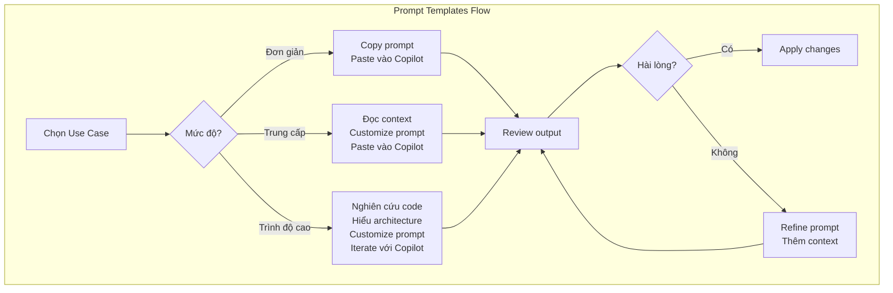
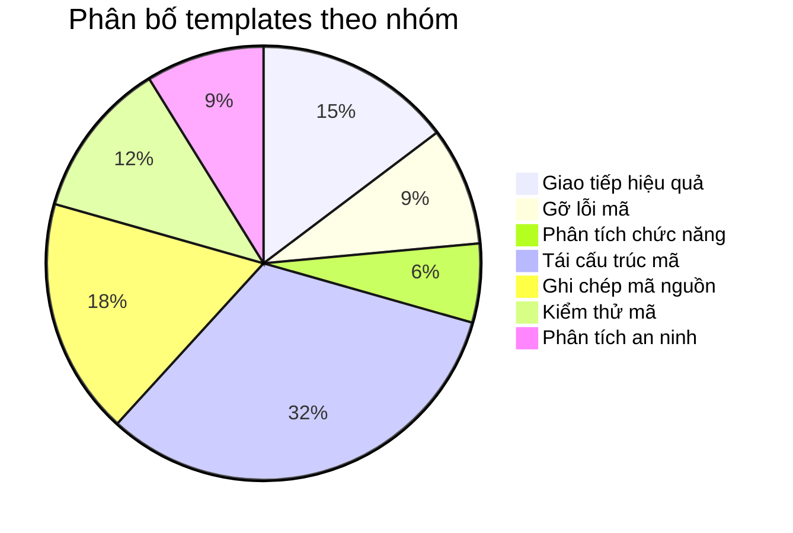

# Copilot Chat - Prompt Templates

> 34 prompt templates chi tiết cho từng use case, áp dụng vào mã nguồn thực tế trong repo [ATC-O48/Claude-OpenAI-Code](https://github.com/ATC-O48/Claude-OpenAI-Code) và [ATC-O48/copilot-cli](https://github.com/ATC-O48/copilot-cli).

---

## Mục lục

- [Hướng dẫn sử dụng](#hướng-dẫn-sử-dụng)
- [1. Giao tiếp hiệu quả](#1-giao-tiếp-hiệu-quả)
  - [UC-01 Tạo mẫu](#uc-01-tạo-mẫu-generate-templates)
  - [UC-02 Trích xuất thông tin](#uc-02-trích-xuất-thông-tin-extract-information)
  - [UC-03 Tổng hợp nghiên cứu](#uc-03-tổng-hợp-nghiên-cứu-synthesize-research)
  - [UC-04 Tạo sơ đồ](#uc-04-tạo-sơ-đồ-create-diagrams)
  - [UC-05 Tạo bảng](#uc-05-tạo-bảng-create-tables)
- [2. Gỡ lỗi mã](#2-gỡ-lỗi-mã)
  - [UC-06 Gỡ lỗi JSON](#uc-06-gỡ-lỗi-json-không-hợp-lệ-debug-invalid-json)
  - [UC-07 Xử lý API rate limit](#uc-07-xử-lý-giới-hạn-tỷ-lệ-truy-cập-api-handle-api-rate-limits)
  - [UC-08 Chẩn đoán lỗi test](#uc-08-chẩn-đoán-lỗi-kiểm-tra-diagnose-test-failures)
- [3. Phân tích chức năng](#3-phân-tích-chức-năng)
  - [UC-09 Khám phá phương án](#uc-09-khám-phá-phương-án-triển-khai-explore-feature-implementations)
  - [UC-10 Phân tích phản hồi](#uc-10-phân-tích-phản-hồi-người-dùng-analyze-user-feedback)
- [4. Tái cấu trúc mã](#4-tái-cấu-trúc-mã)
  - [UC-11 Cải thiện đọc hiểu](#uc-11-cải-thiện-khả-năng-đọc-hiểu-mã-improve-code-readability)
  - [UC-12 Sửa lỗi lint](#uc-12-sửa-lỗi-lint-fix-lint-errors)
  - [UC-13 Tái cấu trúc hiệu năng](#uc-13-tái-cấu-trúc-hiệu-năng-refactor-for-performance)
  - [UC-14 Tái cấu trúc bền vững](#uc-14-tái-cấu-trúc-bền-vững-refactor-for-sustainability)
  - [UC-15 Tái cấu trúc mẫu thiết kế](#uc-15-tái-cấu-trúc-mẫu-thiết-kế-refactor-to-design-pattern)
  - [UC-16 Tái cấu trúc data access](#uc-16-tái-cấu-trúc-lớp-truy-cập-dữ-liệu-refactor-data-access-layers)
  - [UC-17 Tách logic/UI](#uc-17-tách-logic-nghiệp-vụ-khỏi-ui-decouple-business-logic-from-ui)
  - [UC-18 Vấn đề xuyên suốt](#uc-18-giải-quyết-vấn-đề-xuyên-suốt-address-cross-cutting-concerns)
  - [UC-19 Đơn giản hóa kế thừa](#uc-19-đơn-giản-hóa-kế-thừa-simplify-inheritance-hierarchies)
  - [UC-20 Tắc nghẽn DB](#uc-20-khắc-phục-tắc-nghẽn-db-fix-database-bottlenecks)
  - [UC-21 Dịch mã](#uc-21-dịch-mã-translate-code)
- [5. Ghi chép mã nguồn](#5-ghi-chép-mã-nguồn)
  - [UC-22 Tạo vấn đề](#uc-22-tạo-vấn-đề-create-issues)
  - [UC-23 Ghi chép mã cũ](#uc-23-ghi-chép-mã-nguồn-cũ-document-legacy-code)
  - [UC-24 Giải thích mã cũ](#uc-24-giải-thích-mã-nguồn-cũ-explain-legacy-code)
  - [UC-25 Giải thích thuật toán](#uc-25-giải-thích-thuật-toán-phức-tạp-explain-complex-algorithms)
  - [UC-26 Đồng bộ tài liệu](#uc-26-đồng-bộ-tài-liệu-sync-documentation)
  - [UC-27 Viết blog](#uc-27-viết-bài-blogthảo-luận-write-blog-posts)
- [6. Kiểm thử mã](#6-kiểm-thử-mã)
  - [UC-28 Tạo unit tests](#uc-28-tạo-bài-kiểm-tra-đơn-vị-generate-unit-tests)
  - [UC-29 Tạo mock objects](#uc-29-tạo-đối-tượng-giả-create-mock-objects)
  - [UC-30 Tạo E2E tests](#uc-30-tạo-kiểm-tra-e2e-create-e2e-tests)
  - [UC-31 Cập nhật tests](#uc-31-cập-nhật-bài-kiểm-thử-update-unit-tests)
- [7. Phân tích an ninh](#7-phân-tích-an-ninh)
  - [UC-32 Bảo mật repo](#uc-32-bảo-mật-kho-lưu-trữ-secure-repository)
  - [UC-33 Quản lý phụ thuộc](#uc-33-quản-lý-phụ-thuộc-manage-dependencies)
  - [UC-34 Tìm lỗ hổng](#uc-34-tìm-lỗ-hổng-bảo-mật-find-security-vulnerabilities)
- [Sơ đồ tổng quan](#sơ-đồ-tổng-quan)
- [Tài liệu liên quan](#tài-liệu-liên-quan)

---

## Hướng dẫn sử dụng

Mỗi prompt template bao gồm:
- **Tên use case** (tiếng Việt + tiếng Anh)
- **Mức độ**: Đơn giản / Trung cấp / Trình độ cao
- **Prompt mẫu tiếng Việt**: Sử dụng trực tiếp trong Copilot Chat
- **Prompt mẫu tiếng Anh**: Phiên bản tiếng Anh tương đương
- **Ví dụ áp dụng**: Context cụ thể trong repo

> **Mẹo**: Copy prompt mẫu, thay đổi tên file/dòng code nếu cần, paste vào Copilot Chat. Sử dụng `@workspace` để Copilot tham chiếu toàn bộ dự án.

---

## 1. Giao tiếp hiệu quả

### UC-01: Tạo mẫu (Generate Templates)

| Thuộc tính | Chi tiết |
|---|---|
| **Mức độ** | Đơn giản |
| **File liên quan** | `README.md` (dòng 240-258), `.github/ISSUE_TEMPLATE/` |
| **Xem ánh xạ** | [COPILOT_CODE_MAPPING.md → UC-01](./COPILOT_CODE_MAPPING.md#uc-01-tạo-mẫu-generate-templates) |

**Prompt tiếng Việt:**

```
Tạo một mẫu PR template cho dự án React/TypeScript IDE này, bao gồm checklist cho:
thay đổi UI, thay đổi store, thêm tool mới, và cập nhật CSS.

Yêu cầu:
- Phần mô tả thay đổi
- Checklist kiểm tra trước khi merge
- Section cho screenshots (nếu thay đổi UI)
- Ghi chú cho reviewer
```

**Prompt tiếng Anh:**

```
Create a PR template for this React/TypeScript IDE project with checklists for:
UI changes, store changes, new tool additions, and CSS updates.

Include:
- Change description section
- Pre-merge checklist
- Screenshots section (for UI changes)
- Reviewer notes
```

**Ví dụ áp dụng:**

Áp dụng vào `.github/PULL_REQUEST_TEMPLATE.md` — hiện repo chưa có PR template. Template nên phản ánh cấu trúc dự án: `src/components/`, `src/stores/`, `src/index.css`.

---

### UC-02: Trích xuất thông tin (Extract Information)

| Thuộc tính | Chi tiết |
|---|---|
| **Mức độ** | Đơn giản |
| **File liên quan** | `changelog.md` (repo copilot-cli) |
| **Xem ánh xạ** | [COPILOT_CODE_MAPPING.md → UC-02](./COPILOT_CODE_MAPPING.md#uc-02-trích-xuất-thông-tin-extract-information) |

**Prompt tiếng Việt:**

```
Trích xuất tất cả các tính năng mới được thêm vào từ phiên bản 1.0.30 đến 1.0.36
trong changelog.md, phân loại theo: bug fix, tính năng mới, cải thiện hiệu năng.

Output dưới dạng bảng markdown với cột: Phiên bản, Loại, Mô tả ngắn.
```

**Prompt tiếng Anh:**

```
Extract all new features added between versions 1.0.30 and 1.0.36 from changelog.md.
Categorize them as: bug fix, new feature, performance improvement.

Output as a markdown table with columns: Version, Type, Short Description.
```

**Ví dụ áp dụng:**

Áp dụng vào repo `ATC-O48/copilot-cli` — file `changelog.md` có ~1680 dòng covering 36+ phiên bản. Giúp team hiểu nhanh evolution của sản phẩm.

---

### UC-03: Tổng hợp nghiên cứu (Synthesize Research)

| Thuộc tính | Chi tiết |
|---|---|
| **Mức độ** | Đơn giản |
| **File liên quan** | `README.md`, `docs/DESIGN_REVIEW.md` |
| **Xem ánh xạ** | [COPILOT_CODE_MAPPING.md → UC-03](./COPILOT_CODE_MAPPING.md#uc-03-tổng-hợp-nghiên-cứu-synthesize-research) |

**Prompt tiếng Việt:**

```
Tổng hợp kiến trúc của Workspace IDE từ README.md và DESIGN_REVIEW.md thành một
bản tóm tắt kỹ thuật 500 từ, bao gồm:
- Điểm mạnh của kiến trúc hiện tại
- Điểm yếu cần cải thiện
- Đề xuất cải thiện theo thứ tự ưu tiên

Sử dụng @workspace để tham chiếu cả 2 file.
```

**Prompt tiếng Anh:**

```
Synthesize the Workspace IDE architecture from README.md and DESIGN_REVIEW.md into
a 500-word technical summary including:
- Current architecture strengths
- Weaknesses to address
- Prioritized improvement recommendations

Use @workspace to reference both files.
```

**Ví dụ áp dụng:**

Kết hợp thông tin từ `README.md` (tech stack, features) với `docs/DESIGN_REVIEW.md` (detailed analysis, recommendations) để tạo executive summary cho stakeholders.

---

### UC-04: Tạo sơ đồ (Create Diagrams)

| Thuộc tính | Chi tiết |
|---|---|
| **Mức độ** | Đơn giản |
| **File liên quan** | `docs/DESIGN_REVIEW.md` (dòng 1-129) |
| **Xem ánh xạ** | [COPILOT_CODE_MAPPING.md → UC-04](./COPILOT_CODE_MAPPING.md#uc-04-tạo-sơ-đồ-create-diagrams) |

**Prompt tiếng Việt:**

```
Tạo sơ đồ Mermaid mô tả luồng dữ liệu từ khi người dùng click một file trong
FileTree cho đến khi nội dung hiển thị trong EditorTool, đi qua workspaceStore.

Bao gồm các bước:
1. User click file trong FileTree.tsx
2. Gọi openFile() trong workspaceStore.ts
3. findFileNode() tìm file content
4. addTab() thêm tab mới vào pane
5. EditorTool.tsx render nội dung

Sử dụng Mermaid sequence diagram.
```

**Prompt tiếng Anh:**

```
Create a Mermaid sequence diagram showing the data flow from when a user clicks
a file in FileTree to when content is displayed in EditorTool via workspaceStore.

Include steps:
1. User clicks file in FileTree.tsx
2. openFile() called in workspaceStore.ts
3. findFileNode() locates file content
4. addTab() adds new tab to pane
5. EditorTool.tsx renders content

Use Mermaid sequence diagram syntax.
```

**Ví dụ áp dụng:**

Bổ sung vào `docs/DESIGN_REVIEW.md` hiện đang mô tả kiến trúc bằng text. Mermaid diagrams giúp visualize luồng dữ liệu phức tạp giữa components.

---

### UC-05: Tạo bảng (Create Tables)

| Thuộc tính | Chi tiết |
|---|---|
| **Mức độ** | Đơn giản |
| **File liên quan** | `src/components/tools/ToolRenderer.tsx` (dòng 17-44) |
| **Xem ánh xạ** | [COPILOT_CODE_MAPPING.md → UC-05](./COPILOT_CODE_MAPPING.md#uc-05-tạo-bảng-create-tables) |

**Prompt tiếng Việt:**

```
Tạo bảng so sánh tất cả 9 tools trong ToolRenderer.tsx, bao gồm các cột:
- Tên tool
- ToolType (enum value)
- Có state riêng không (local state vs store)
- Có kết nối workspaceStore không
- Số dòng code
- Độ phức tạp (Thấp/Trung bình/Cao)

Dựa trên mã nguồn thực tế trong src/components/tools/.
```

**Prompt tiếng Anh:**

```
Create a comparison table for all 9 tools in ToolRenderer.tsx with columns:
- Tool name
- ToolType (enum value)
- Has own state (local state vs store)
- Connected to workspaceStore
- Lines of code
- Complexity (Low/Medium/High)

Base the analysis on actual source code in src/components/tools/.
```

**Ví dụ áp dụng:**

Bổ sung vào `README.md` dòng 136-147 — bảng tools hiện tại chỉ có tên và mô tả ngắn. Bảng chi tiết hơn giúp contributors hiểu nhanh cấu trúc tools.

---

## 2. Gỡ lỗi mã

### UC-06: Gỡ lỗi JSON không hợp lệ (Debug Invalid JSON)

| Thuộc tính | Chi tiết |
|---|---|
| **Mức độ** | Trung cấp |
| **File liên quan** | `src/stores/workspaceStore.ts` (dòng 74-108) |
| **Xem ánh xạ** | [COPILOT_CODE_MAPPING.md → UC-06](./COPILOT_CODE_MAPPING.md#uc-06-gỡ-lỗi-json-không-hợp-lệ-debug-invalid-json) |

**Prompt tiếng Việt:**

```
Kiểm tra cấu trúc JSON trong sampleFiles (workspaceStore.ts dòng 74-108).
Xác minh tất cả FileNode objects có đầy đủ required fields theo interface FileNode
trong workspace.ts.

Cụ thể kiểm tra:
- Mỗi FileNode có id, name, type đúng format
- Folders có children array (không phải undefined)
- Files có content string
- Không có circular references
- IDs là unique

Liệt kê bất kỳ vi phạm nào tìm thấy.
```

**Prompt tiếng Anh:**

```
Validate the JSON structure in sampleFiles (workspaceStore.ts lines 74-108).
Verify all FileNode objects have required fields per the FileNode interface
in workspace.ts.

Specifically check:
- Each FileNode has id, name, type in correct format
- Folders have children array (not undefined)
- Files have content string
- No circular references
- IDs are unique

List any violations found.
```

**Ví dụ áp dụng:**

`workspaceStore.ts` dòng 74-108 chứa hardcoded sample data. Khi thêm files mới vào sample data, dễ quên field hoặc sai type. Copilot có thể validate trước khi runtime.

---

### UC-07: Xử lý giới hạn tỷ lệ truy cập API (Handle API Rate Limits)

| Thuộc tính | Chi tiết |
|---|---|
| **Mức độ** | Trung cấp |
| **File liên quan** | `src/components/tools/AgentTool.tsx` (dòng 17-26) |
| **Xem ánh xạ** | [COPILOT_CODE_MAPPING.md → UC-07](./COPILOT_CODE_MAPPING.md#uc-07-xử-lý-giới-hạn-tỷ-lệ-truy-cập-api-handle-api-rate-limits) |

**Prompt tiếng Việt:**

```
AgentTool.tsx hiện tại trả về mock response (dòng 17-26). Viết logic xử lý
API call thật với:

1. Exponential backoff: delay tăng gấp đôi sau mỗi retry (1s, 2s, 4s, 8s)
2. Retry tự động sau HTTP 429 status (max 3 retries)
3. Hiển thị trạng thái cho người dùng: loading, retrying (lần thứ n), error
4. Cancel request khi component unmount
5. Timeout sau 30 giây

Giữ nguyên interface hiện tại (messages state, handleSend function).
Sử dụng AbortController cho cancellation.
```

**Prompt tiếng Anh:**

```
AgentTool.tsx currently returns mock responses (lines 17-26). Write real API
call logic with:

1. Exponential backoff: delay doubles per retry (1s, 2s, 4s, 8s)
2. Auto-retry on HTTP 429 status (max 3 retries)
3. User-facing status: loading, retrying (attempt n), error
4. Cancel request on component unmount
5. 30-second timeout

Keep existing interface (messages state, handleSend function).
Use AbortController for cancellation.
```

**Ví dụ áp dụng:**

Khi kết nối AgentTool với API thật (OpenAI, Anthropic), rate limiting là vấn đề phổ biến. Template này giúp viết robust API client cho chat interface.

---

### UC-08: Chẩn đoán lỗi kiểm tra (Diagnose Test Failures)

| Thuộc tính | Chi tiết |
|---|---|
| **Mức độ** | Trung cấp |
| **File liên quan** | `src/stores/workspaceStore.ts` (dòng 483-499) |
| **Xem ánh xạ** | [COPILOT_CODE_MAPPING.md → UC-08](./COPILOT_CODE_MAPPING.md#uc-08-chẩn-đoán-lỗi-kiểm-tra-diagnose-test-failures) |

**Prompt tiếng Việt:**

```
Giả sử test cho hàm `duplicateFile` trong workspaceStore.ts thất bại khi
duplicate file ở root level (không có parentPath). Phân tích logic dòng 483-499
và tìm nguyên nhân.

Câu hỏi cần trả lời:
1. `parentPath` có giá trị gì khi file ở root?
2. `findFileNode(parentPath)` trả về gì khi path rỗng?
3. Điều kiện nào gây ra silent failure (không throw error)?
4. Đề xuất fix và test case bổ sung
```

**Prompt tiếng Anh:**

```
Assume the test for `duplicateFile` in workspaceStore.ts fails when duplicating
a file at root level (no parentPath). Analyze the logic at lines 483-499
and find the root cause.

Answer:
1. What is `parentPath` when the file is at root?
2. What does `findFileNode(parentPath)` return for an empty path?
3. What condition causes a silent failure (no thrown error)?
4. Suggest a fix and additional test cases
```

**Ví dụ áp dụng:**

Hàm `duplicateFile` sử dụng `path.split('/').slice(0, -1).join('/')` để tìm parent. Khi file ở root, path có thể là `"filename"` → parentPath = `""` → `findFileNode("")` = `null` → silent fail.

---

## 3. Phân tích chức năng

### UC-09: Khám phá phương án triển khai (Explore Feature Implementations)

| Thuộc tính | Chi tiết |
|---|---|
| **Mức độ** | Trung cấp |
| **File liên quan** | `src/components/layout/PaneView.tsx`, `package.json` |
| **Xem ánh xạ** | [COPILOT_CODE_MAPPING.md → UC-09](./COPILOT_CODE_MAPPING.md#uc-09-khám-phá-phương-án-triển-khai-explore-feature-implementations) |

**Prompt tiếng Việt:**

```
Đề xuất 3 phương án khác nhau để triển khai tính năng drag-and-drop tab reordering
trong PaneView.tsx, sử dụng @dnd-kit đã có trong package.json.

Cho mỗi phương án, cung cấp:
- Mô tả kỹ thuật (2-3 câu)
- Ưu điểm
- Nhược điểm
- Độ phức tạp triển khai (giờ)
- Code skeleton minh họa

So sánh: @dnd-kit/sortable vs HTML5 native drag vs custom pointer events.
Context: tabs hiện tại là danh sách ngang, mỗi tab có id và toolType.
```

**Prompt tiếng Anh:**

```
Propose 3 different approaches for implementing drag-and-drop tab reordering
in PaneView.tsx, using @dnd-kit already in package.json.

For each approach, provide:
- Technical description (2-3 sentences)
- Pros
- Cons
- Implementation complexity (hours)
- Code skeleton

Compare: @dnd-kit/sortable vs HTML5 native drag vs custom pointer events.
Context: tabs are a horizontal list, each with id and toolType.
```

**Ví dụ áp dụng:**

`package.json` đã có `@dnd-kit/core` và `@dnd-kit/sortable`. PaneView hiện có tab bar nhưng chưa hỗ trợ reorder. Template giúp evaluate options trước khi implement.

---

### UC-10: Phân tích phản hồi người dùng (Analyze User Feedback)

| Thuộc tính | Chi tiết |
|---|---|
| **Mức độ** | Trung cấp |
| **File liên quan** | `docs/DESIGN_REVIEW.md` (dòng 1-129) |
| **Xem ánh xạ** | [COPILOT_CODE_MAPPING.md → UC-10](./COPILOT_CODE_MAPPING.md#uc-10-phân-tích-phản-hồi-người-dùng-analyze-user-feedback) |

**Prompt tiếng Việt:**

```
Dựa trên DESIGN_REVIEW.md, tổng hợp tất cả 'Recommendations' và tạo danh sách
ưu tiên theo impact/effort matrix.

Format output:
| Recommendation | Impact (1-5) | Effort (1-5) | Priority Score | Sprint |
|---|---|---|---|---|

- Impact: ảnh hưởng đến user experience
- Effort: thời gian dev cần (1=giờ, 5=tuần)
- Priority Score = Impact / Effort
- Sprint: gợi ý sprint nào nên thực hiện (Now/Next/Later)

Sắp xếp theo Priority Score giảm dần.
```

**Prompt tiếng Anh:**

```
From DESIGN_REVIEW.md, compile all 'Recommendations' and create a prioritized
list using an impact/effort matrix.

Output format:
| Recommendation | Impact (1-5) | Effort (1-5) | Priority Score | Sprint |
|---|---|---|---|---|

- Impact: effect on user experience
- Effort: dev time needed (1=hours, 5=weeks)
- Priority Score = Impact / Effort
- Sprint: suggested sprint (Now/Next/Later)

Sort by Priority Score descending.
```

**Ví dụ áp dụng:**

`DESIGN_REVIEW.md` chứa nhiều recommendations: persistent state, undo/redo, plugin system, accessibility, performance. Template giúp biến qualitative feedback thành actionable backlog.

---

## 4. Tái cấu trúc mã

### UC-11: Cải thiện khả năng đọc hiểu mã (Improve Code Readability)

| Thuộc tính | Chi tiết |
|---|---|
| **Mức độ** | Đơn giản |
| **File liên quan** | `src/stores/workspaceStore.ts` (dòng 153-252) |
| **Xem ánh xạ** | [COPILOT_CODE_MAPPING.md → UC-11](./COPILOT_CODE_MAPPING.md#uc-11-cải-thiện-khả-năng-đọc-hiểu-mã-improve-code-readability) |

**Prompt tiếng Việt:**

```
Cải thiện khả năng đọc hiểu của hàm `findPaneAndUpdate` và `splitInLayout`
trong workspaceStore.ts (dòng 153-252). Cụ thể:

1. Thêm JSDoc cho mỗi hàm (mục đích, params, return, example)
2. Đổi tên biến rõ ràng hơn:
   - `cb` → `updateCallback` hoặc `transformFn`
   - `node` → `currentPane` hoặc `layoutNode`
3. Tách logic phức tạp thành helper functions có tên mô tả
4. Thêm early returns để giảm nesting
5. Giữ nguyên hành vi, chỉ cải thiện readability
```

**Prompt tiếng Anh:**

```
Improve readability of `findPaneAndUpdate` and `splitInLayout` functions
in workspaceStore.ts (lines 153-252). Specifically:

1. Add JSDoc for each function (purpose, params, return, example)
2. Rename variables for clarity:
   - `cb` → `updateCallback` or `transformFn`
   - `node` → `currentPane` or `layoutNode`
3. Extract complex logic into descriptively named helper functions
4. Add early returns to reduce nesting
5. Preserve behavior, only improve readability
```

**Ví dụ áp dụng:**

Ba hàm đệ quy trong workspaceStore.ts là core logic nhưng khó đọc. Tên biến generic (`cb`, `node`) không truyền đạt intent. JSDoc sẽ giúp contributors mới hiểu nhanh.

---

### UC-12: Sửa lỗi lint (Fix Lint Errors)

| Thuộc tính | Chi tiết |
|---|---|
| **Mức độ** | Trung cấp |
| **File liên quan** | `eslint.config.js`, `src/**/*.{ts,tsx}` |
| **Xem ánh xạ** | [COPILOT_CODE_MAPPING.md → UC-12](./COPILOT_CODE_MAPPING.md#uc-12-sửa-lỗi-lint-fix-lint-errors) |

**Prompt tiếng Việt:**

```
Chạy ESLint trên toàn bộ src/ với config trong eslint.config.js.
Liệt kê tất cả lỗi và cảnh báo, phân loại theo:

1. Errors (phải sửa):
   - Unused variables/imports
   - Missing dependencies trong useEffect
   - Type errors

2. Warnings (nên sửa):
   - Naming conventions
   - Unused parameters
   - Console.log statements

Cho mỗi loại lỗi, đề xuất cách sửa cụ thể (auto-fix hoặc manual fix).
Chạy: `npm run lint` để lấy danh sách lỗi.
```

**Prompt tiếng Anh:**

```
Run ESLint on the entire src/ directory using the config in eslint.config.js.
List all errors and warnings, categorized as:

1. Errors (must fix):
   - Unused variables/imports
   - Missing useEffect dependencies
   - Type errors

2. Warnings (should fix):
   - Naming conventions
   - Unused parameters
   - Console.log statements

For each error type, suggest a specific fix (auto-fix or manual).
Run: `npm run lint` to get the error list.
```

**Ví dụ áp dụng:**

Config sử dụng `typescript-eslint`, `react-hooks`, `react-refresh` plugins. Chạy `npm run lint` sẽ reveal các vấn đề phổ biến trong React/TypeScript codebase.

---

### UC-13: Tái cấu trúc hiệu năng (Refactor for Performance)

| Thuộc tính | Chi tiết |
|---|---|
| **Mức độ** | Đơn giản |
| **File liên quan** | `src/components/search/SearchBar.tsx` (dòng 6-15, 47-94) |
| **Xem ánh xạ** | [COPILOT_CODE_MAPPING.md → UC-13](./COPILOT_CODE_MAPPING.md#uc-13-tái-cấu-trúc-hiệu-năng-refactor-for-performance) |

**Prompt tiếng Việt:**

```
Tối ưu SearchBar.tsx: flattenFiles() (dòng 6-15) được gọi mỗi lần render.
Đề xuất và implement cải thiện:

1. Memoize flattenFiles() với useMemo, dependency là files array
2. Thêm debounce cho search input (300ms) dùng useCallback + setTimeout
3. Virtualize danh sách kết quả khi có nhiều files (react-window hoặc tương tự)
4. Tối ưu filter logic: dùng .includes() thay vì regex nếu không cần pattern matching

Giữ nguyên UI hiện tại, chỉ cải thiện performance.
Ước lượng cải thiện re-render cho mỗi thay đổi.
```

**Prompt tiếng Anh:**

```
Optimize SearchBar.tsx: flattenFiles() (lines 6-15) runs on every render.
Suggest and implement improvements:

1. Memoize flattenFiles() with useMemo, depending on files array
2. Add debounce for search input (300ms) using useCallback + setTimeout
3. Virtualize results list for large file counts (react-window or similar)
4. Optimize filter logic: use .includes() instead of regex if no pattern matching

Keep current UI, only improve performance.
Estimate re-render improvement for each change.
```

**Ví dụ áp dụng:**

`flattenFiles()` recursive traversal chạy O(n) trên mỗi keystroke. Với 1000+ files, mỗi ký tự gõ gây re-render chậm. Memoization + debounce giảm 90%+ unnecessary computation.

---

### UC-14: Tái cấu trúc bền vững (Refactor for Sustainability)

| Thuộc tính | Chi tiết |
|---|---|
| **Mức độ** | Đơn giản |
| **File liên quan** | `src/index.css` (1-1147 dòng) |
| **Xem ánh xạ** | [COPILOT_CODE_MAPPING.md → UC-14](./COPILOT_CODE_MAPPING.md#uc-14-tái-cấu-trúc-bền-vững-refactor-for-sustainability) |

**Prompt tiếng Việt:**

```
index.css có 1147 dòng. Đề xuất cách tách thành CSS modules hoặc Tailwind
components. Cụ thể:

1. Phân tích file: nhóm styles theo component (layout, filetree, tools, search...)
2. Đề xuất cấu trúc tách file:
   - src/styles/layout.css
   - src/styles/filetree.css
   - src/styles/tools.css
   - ...
3. Xác định CSS không sử dụng (dead CSS)
4. Đề xuất cách giảm specificity conflicts
5. Migration plan: thứ tự tách, cách test không break UI

Dự án dùng Tailwind CSS v4, nên tận dụng utility classes khi phù hợp.
```

**Prompt tiếng Anh:**

```
index.css has 1147 lines. Propose a strategy to split into CSS modules or
Tailwind components. Specifically:

1. Analyze file: group styles by component (layout, filetree, tools, search...)
2. Propose file structure:
   - src/styles/layout.css
   - src/styles/filetree.css
   - src/styles/tools.css
   - ...
3. Identify unused CSS (dead CSS)
4. Propose how to reduce specificity conflicts
5. Migration plan: order of extraction, how to test without breaking UI

Project uses Tailwind CSS v4, so leverage utility classes where appropriate.
```

**Ví dụ áp dụng:**

`index.css` chứa styles cho mọi component trong 1 file. Khi team grow, merge conflicts trên file CSS sẽ tăng. Tách modules giúp parallel development.

---

### UC-15: Tái cấu trúc mẫu thiết kế (Refactor to Design Pattern)

| Thuộc tính | Chi tiết |
|---|---|
| **Mức độ** | Trung cấp |
| **File liên quan** | `src/components/tools/ToolRenderer.tsx` (dòng 17-44) |
| **Xem ánh xạ** | [COPILOT_CODE_MAPPING.md → UC-15](./COPILOT_CODE_MAPPING.md#uc-15-tái-cấu-trúc-mẫu-thiết-kế-refactor-to-design-pattern) |

**Prompt tiếng Việt:**

```
Refactor ToolRenderer.tsx từ switch-case (dòng 17-44) sang Registry Pattern.

Yêu cầu:
1. Tạo toolRegistry: Map<ToolType, React.ComponentType<ToolProps>>
2. Hàm registerTool(type, component) để đăng ký tool mới
3. ToolRenderer chỉ cần: toolRegistry.get(type) || <FallbackTool />
4. Mỗi tool tự đăng ký vào registry (self-registration)
5. Type-safe: đảm bảo ToolType enum khớp với registry keys

Lợi ích: thêm tool mới không cần sửa ToolRenderer, Open/Closed Principle.
Giữ nguyên 9 tools hiện tại: editor, preview, console, shell, secrets,
file-history, multiplayer, settings, agent.
```

**Prompt tiếng Anh:**

```
Refactor ToolRenderer.tsx from switch-case (lines 17-44) to Registry Pattern.

Requirements:
1. Create toolRegistry: Map<ToolType, React.ComponentType<ToolProps>>
2. registerTool(type, component) function for new tool registration
3. ToolRenderer only needs: toolRegistry.get(type) || <FallbackTool />
4. Each tool self-registers into the registry
5. Type-safe: ensure ToolType enum matches registry keys

Benefit: add new tools without modifying ToolRenderer, Open/Closed Principle.
Keep all 9 existing tools: editor, preview, console, shell, secrets,
file-history, multiplayer, settings, agent.
```

**Ví dụ áp dụng:**

`ToolRenderer.tsx` hiện có switch-case cho 9 tools. Mỗi khi thêm tool mới, phải sửa file này — vi phạm Open/Closed Principle. Registry Pattern cho phép plugin-style tool registration.

---

### UC-16: Tái cấu trúc lớp truy cập dữ liệu (Refactor Data Access Layers)

| Thuộc tính | Chi tiết |
|---|---|
| **Mức độ** | Trình độ cao |
| **File liên quan** | `src/stores/workspaceStore.ts` (dòng 254-519) |
| **Xem ánh xạ** | [COPILOT_CODE_MAPPING.md → UC-16](./COPILOT_CODE_MAPPING.md#uc-16-tái-cấu-trúc-lớp-truy-cập-dữ-liệu-refactor-data-access-layers) |

**Prompt tiếng Việt:**

```
workspaceStore.ts chứa cả data access (findFileNode, updateFileNodes) và
business logic (openFile, duplicateFile). Tách thành:

1. src/services/fileSystemService.ts:
   - findFileNode(files, path): FileNode | null
   - updateFileNodes(files, path, updater): FileNode[]
   - createFileNode(name, type, content?): FileNode
   - getFilePath(files, fileId): string

2. src/services/workspaceActions.ts:
   - openFile(state, path): StateUpdate
   - createFile(state, parentPath, name): StateUpdate
   - deleteFile(state, path): StateUpdate
   - duplicateFile(state, path): StateUpdate

3. workspaceStore.ts chỉ còn: state definition + action wiring

Đảm bảo:
- Services là pure functions (dễ test)
- Store actions gọi services
- Types được export đúng cách
```

**Prompt tiếng Anh:**

```
workspaceStore.ts contains both data access (findFileNode, updateFileNodes) and
business logic (openFile, duplicateFile). Split into:

1. src/services/fileSystemService.ts:
   - findFileNode(files, path): FileNode | null
   - updateFileNodes(files, path, updater): FileNode[]
   - createFileNode(name, type, content?): FileNode
   - getFilePath(files, fileId): string

2. src/services/workspaceActions.ts:
   - openFile(state, path): StateUpdate
   - createFile(state, parentPath, name): StateUpdate
   - deleteFile(state, path): StateUpdate
   - duplicateFile(state, path): StateUpdate

3. workspaceStore.ts retains: state definition + action wiring only

Ensure:
- Services are pure functions (easy to test)
- Store actions call services
- Types are properly exported
```

**Ví dụ áp dụng:**

Store hiện tại 519 dòng là monolith. Tách services giúp: unit test data access riêng, reuse logic giữa components, giảm cognitive load khi đọc store.

---

### UC-17: Tách logic nghiệp vụ khỏi UI (Decouple Business Logic from UI)

| Thuộc tính | Chi tiết |
|---|---|
| **Mức độ** | Trình độ cao |
| **File liên quan** | `src/components/filetree/FileTree.tsx` (dòng 75-187), `FileContextMenu.tsx` (dòng 36-54) |
| **Xem ánh xạ** | [COPILOT_CODE_MAPPING.md → UC-17](./COPILOT_CODE_MAPPING.md#uc-17-tách-logic-nghiệp-vụ-khỏi-ui-decouple-business-logic-from-ui) |

**Prompt tiếng Việt:**

```
FileTree.tsx (dòng 75-187) trộn lẫn UI và logic. Tách thành:

1. Custom hook useFileTreeActions():
   - handleNewFile(parentPath: string): void
   - handleCreateFile(name: string, type: 'file' | 'folder'): void
   - handleContextMenu(e: MouseEvent, node: FileNode): void
   - isCreating: boolean
   - newFileName: string
   - setNewFileName: (name: string) => void

2. FileTree.tsx chỉ còn JSX rendering:
   - Nhận actions từ hook
   - Render tree nodes
   - Delegate events cho hook

3. Tương tự cho FileContextMenu.tsx:
   - Tách handleRename (hiện dùng window.prompt()) vào hook
   - Tách handleDownload (tạo Blob + download) vào utility

Giữ nguyên UI hiện tại, chỉ di chuyển logic.
```

**Prompt tiếng Anh:**

```
FileTree.tsx (lines 75-187) mixes UI and logic. Decouple into:

1. Custom hook useFileTreeActions():
   - handleNewFile(parentPath: string): void
   - handleCreateFile(name: string, type: 'file' | 'folder'): void
   - handleContextMenu(e: MouseEvent, node: FileNode): void
   - isCreating: boolean
   - newFileName: string
   - setNewFileName: (name: string) => void

2. FileTree.tsx becomes JSX-only:
   - Receives actions from hook
   - Renders tree nodes
   - Delegates events to hook

3. Same for FileContextMenu.tsx:
   - Extract handleRename (currently uses window.prompt()) into hook
   - Extract handleDownload (Blob creation + download) into utility

Keep current UI, only move logic.
```

**Ví dụ áp dụng:**

FileTree.tsx hiện là 188 dòng trộn state management, event handlers, và JSX. Custom hooks giúp: test logic riêng, reuse giữa mobile/desktop views, giảm component complexity.

---

### UC-18: Giải quyết vấn đề xuyên suốt (Address Cross-Cutting Concerns)

| Thuộc tính | Chi tiết |
|---|---|
| **Mức độ** | Trung cấp |
| **File liên quan** | `PaneOptionsMenu.tsx` (dòng 22-30), `FileContextMenu.tsx`, `SearchBar.tsx` |
| **Xem ánh xạ** | [COPILOT_CODE_MAPPING.md → UC-18](./COPILOT_CODE_MAPPING.md#uc-18-giải-quyết-vấn-đề-xuyên-suốt-address-cross-cutting-concerns) |

**Prompt tiếng Việt:**

```
Click-outside detection logic lặp lại ở PaneOptionsMenu.tsx (dòng 22-30),
FileContextMenu.tsx, và SearchBar.tsx. Tạo custom hook useClickOutside()
để tái sử dụng.

Yêu cầu:
1. Hook signature: useClickOutside(ref: RefObject<HTMLElement>, onClickOutside: () => void)
2. Xử lý cả mousedown và touchstart events
3. Cleanup đúng cách khi unmount
4. Không trigger khi click vào element bên trong ref
5. Option để ignore specific elements (e.g., trigger button)

Sau đó refactor cả 3 component để sử dụng hook mới.
Tạo file: src/hooks/useClickOutside.ts
```

**Prompt tiếng Anh:**

```
Click-outside detection logic is duplicated in PaneOptionsMenu.tsx (lines 22-30),
FileContextMenu.tsx, and SearchBar.tsx. Create a custom hook useClickOutside()
for reuse.

Requirements:
1. Hook signature: useClickOutside(ref: RefObject<HTMLElement>, onClickOutside: () => void)
2. Handle both mousedown and touchstart events
3. Proper cleanup on unmount
4. Don't trigger when clicking inside the ref element
5. Option to ignore specific elements (e.g., trigger button)

Then refactor all 3 components to use the new hook.
Create file: src/hooks/useClickOutside.ts
```

**Ví dụ áp dụng:**

3 components có gần như cùng đoạn code: `useEffect` + `addEventListener('mousedown')` + check `ref.current.contains(e.target)`. Hook giúp DRY và consistent behavior.

---

### UC-19: Đơn giản hóa kế thừa (Simplify Inheritance Hierarchies)

| Thuộc tính | Chi tiết |
|---|---|
| **Mức độ** | Trung cấp |
| **File liên quan** | `src/types/workspace.ts` (dòng 24-45) |
| **Xem ánh xạ** | [COPILOT_CODE_MAPPING.md → UC-19](./COPILOT_CODE_MAPPING.md#uc-19-đơn-giản-hóa-kế-thừa-simplify-inheritance-hierarchies) |

**Prompt tiếng Việt:**

```
Union type `Pane | PaneSplit` lặp lại ở workspace.ts, workspaceStore.ts,
WorkspaceLayout.tsx. Đơn giản hóa:

1. Tạo type alias trong workspace.ts:
   type LayoutNode = Pane | PaneSplit

2. Tạo type guards:
   function isPane(node: LayoutNode): node is Pane
   function isPaneSplit(node: LayoutNode): node is PaneSplit

3. Thay thế tất cả `Pane | PaneSplit` bằng `LayoutNode`

4. Sử dụng type guards thay vì:
   - 'children' in node
   - (node as PaneSplit).children
   - node.type === 'pane'

5. Export từ workspace.ts, import ở các file khác

Liệt kê tất cả vị trí cần thay đổi.
```

**Prompt tiếng Anh:**

```
The union type `Pane | PaneSplit` is repeated across workspace.ts, workspaceStore.ts,
and WorkspaceLayout.tsx. Simplify:

1. Create type alias in workspace.ts:
   type LayoutNode = Pane | PaneSplit

2. Create type guards:
   function isPane(node: LayoutNode): node is Pane
   function isPaneSplit(node: LayoutNode): node is PaneSplit

3. Replace all `Pane | PaneSplit` with `LayoutNode`

4. Use type guards instead of:
   - 'children' in node
   - (node as PaneSplit).children
   - node.type === 'pane'

5. Export from workspace.ts, import in other files

List all locations that need changes.
```

**Ví dụ áp dụng:**

`Pane | PaneSplit` xuất hiện 10+ lần. Type guards giúp TypeScript narrowing tự động, giảm type assertions, và centralize type logic.

---

### UC-20: Khắc phục tắc nghẽn DB (Fix Database Bottlenecks)

| Thuộc tính | Chi tiết |
|---|---|
| **Mức độ** | Trình độ cao |
| **File liên quan** | `src/stores/workspaceStore.ts` |
| **Xem ánh xạ** | [COPILOT_CODE_MAPPING.md → UC-20](./COPILOT_CODE_MAPPING.md#uc-20-khắc-phục-tắc-nghẽn-db-fix-database-bottlenecks) |

**Prompt tiếng Việt:**

```
workspaceStore.ts dùng in-memory state (Zustand). Nếu migrate sang
IndexedDB/localStorage cho persistent file storage, đề xuất:

1. Storage strategy:
   - IndexedDB cho file content (large data)
   - localStorage cho workspace layout (small data)
   - Zustand persist middleware cho auto-sync

2. Tránh blocking UI thread:
   - Web Worker cho IndexedDB read/write operations
   - Async actions thay vì sync set()
   - Optimistic updates: update UI trước, sync sau

3. Migration plan:
   - Phase 1: Zustand persist cho layout state
   - Phase 2: IndexedDB cho file content
   - Phase 3: Web Worker cho background operations

4. Error handling: offline, storage full, concurrent access

Cho code example cho Phase 1 (Zustand persist).
```

**Prompt tiếng Anh:**

```
workspaceStore.ts uses in-memory state (Zustand). For migrating to
IndexedDB/localStorage for persistent file storage, propose:

1. Storage strategy:
   - IndexedDB for file content (large data)
   - localStorage for workspace layout (small data)
   - Zustand persist middleware for auto-sync

2. Avoid blocking UI thread:
   - Web Worker for IndexedDB read/write operations
   - Async actions instead of sync set()
   - Optimistic updates: update UI first, sync later

3. Migration plan:
   - Phase 1: Zustand persist for layout state
   - Phase 2: IndexedDB for file content
   - Phase 3: Web Worker for background operations

4. Error handling: offline, storage full, concurrent access

Provide code example for Phase 1 (Zustand persist).
```

**Ví dụ áp dụng:**

Hiện tại refresh browser = mất hết dữ liệu. Persistent storage là #1 recommendation trong DESIGN_REVIEW.md. Template hướng dẫn migrate không break UX.

---

### UC-21: Dịch mã (Translate Code)

| Thuộc tính | Chi tiết |
|---|---|
| **Mức độ** | Đơn giản |
| **File liên quan** | `src/components/tools/AgentTool.tsx` |
| **Xem ánh xạ** | [COPILOT_CODE_MAPPING.md → UC-21](./COPILOT_CODE_MAPPING.md#uc-21-dịch-mã-translate-code) |

**Prompt tiếng Việt:**

```
Dịch component AgentTool.tsx từ React/TypeScript sang Vue 3 Composition API,
giữ nguyên chức năng chat interface.

Yêu cầu:
1. Giữ nguyên: messages state, input handling, send logic, UI layout
2. Mapping React → Vue:
   - useState → ref/reactive
   - useRef → ref + template ref
   - JSX → template syntax
   - CSS classes giữ nguyên
3. Sử dụng <script setup lang="ts">
4. Tạo file: AgentTool.vue
5. Ghi chú khác biệt chính giữa 2 phiên bản

Component này 58 dòng — phù hợp để học translation patterns.
```

**Prompt tiếng Anh:**

```
Translate AgentTool.tsx from React/TypeScript to Vue 3 Composition API,
keeping the chat interface functionality.

Requirements:
1. Preserve: messages state, input handling, send logic, UI layout
2. React → Vue mapping:
   - useState → ref/reactive
   - useRef → ref + template ref
   - JSX → template syntax
   - CSS classes unchanged
3. Use <script setup lang="ts">
4. Create file: AgentTool.vue
5. Note key differences between the two versions

This component is 58 lines — ideal for learning translation patterns.
```

**Ví dụ áp dụng:**

AgentTool.tsx là component nhỏ (58 dòng) với state management cơ bản — perfect candidate để demo framework translation. Có thể mở rộng sang Svelte, Angular.

---

## 5. Ghi chép mã nguồn

### UC-22: Tạo vấn đề (Create Issues)

| Thuộc tính | Chi tiết |
|---|---|
| **Mức độ** | Đơn giản |
| **File liên quan** | `docs/DESIGN_REVIEW.md`, `.github/` |
| **Xem ánh xạ** | [COPILOT_CODE_MAPPING.md → UC-22](./COPILOT_CODE_MAPPING.md#uc-22-tạo-vấn-đề-create-issues) |

**Prompt tiếng Việt:**

```
Tạo 5 GitHub issues cho dự án Workspace IDE dựa trên 'Areas for Improvement'
trong DESIGN_REVIEW.md. Mỗi issue bao gồm:

1. Title: [Category] Short description
2. Labels: enhancement/bug/documentation + priority
3. Description:
   - Vấn đề hiện tại
   - Giải pháp đề xuất
   - Acceptance criteria (checklist)
   - Files liên quan
4. Effort estimate: S/M/L/XL

5 issues:
- Persistent state (save/load workspace)
- Undo/redo system
- Plugin system architecture
- Accessibility improvements (WCAG 2.1)
- Performance optimization (large file trees)
```

**Prompt tiếng Anh:**

```
Create 5 GitHub issues for the Workspace IDE project based on 'Areas for
Improvement' in DESIGN_REVIEW.md. Each issue includes:

1. Title: [Category] Short description
2. Labels: enhancement/bug/documentation + priority
3. Description:
   - Current problem
   - Proposed solution
   - Acceptance criteria (checklist)
   - Related files
4. Effort estimate: S/M/L/XL

5 issues:
- Persistent state (save/load workspace)
- Undo/redo system
- Plugin system architecture
- Accessibility improvements (WCAG 2.1)
- Performance optimization (large file trees)
```

**Ví dụ áp dụng:**

DESIGN_REVIEW.md liệt kê nhiều recommendations nhưng chưa tracked dưới dạng issues. Template giúp biến design review thành actionable backlog items.

---

### UC-23: Ghi chép mã nguồn cũ (Document Legacy Code)

| Thuộc tính | Chi tiết |
|---|---|
| **Mức độ** | Đơn giản |
| **File liên quan** | `src/stores/workspaceStore.ts` (dòng 254-519) |
| **Xem ánh xạ** | [COPILOT_CODE_MAPPING.md → UC-23](./COPILOT_CODE_MAPPING.md#uc-23-ghi-chép-mã-nguồn-cũ-document-legacy-code) |

**Prompt tiếng Việt:**

```
Thêm JSDoc documentation cho toàn bộ WorkspaceState interface
(workspaceStore.ts dòng 110-151) và tất cả 20+ store actions.

Format cho mỗi action:
/**
 * Mô tả ngắn hành động.
 *
 * @param paramName - Mô tả parameter
 * @returns Mô tả return (nếu có)
 * @example
 * // Ví dụ sử dụng
 * store.actionName(param)
 *
 * @see Liên kết đến related actions
 */

Ưu tiên document:
1. Các actions phức tạp (splitPane, duplicateFile, openFile)
2. Helper functions (findPaneAndUpdate, updateFileNodes)
3. State properties (windows, files, resources)
```

**Prompt tiếng Anh:**

```
Add JSDoc documentation for the entire WorkspaceState interface
(workspaceStore.ts lines 110-151) and all 20+ store actions.

Format for each action:
/**
 * Brief description of the action.
 *
 * @param paramName - Parameter description
 * @returns Return description (if any)
 * @example
 * // Usage example
 * store.actionName(param)
 *
 * @see Link to related actions
 */

Priority order:
1. Complex actions (splitPane, duplicateFile, openFile)
2. Helper functions (findPaneAndUpdate, updateFileNodes)
3. State properties (windows, files, resources)
```

**Ví dụ áp dụng:**

Store có 30+ actions không có documentation. Khi team member mới join, phải đọc implementation để hiểu API. JSDoc giúp IDE autocomplete và onboarding.

---

### UC-24: Giải thích mã nguồn cũ (Explain Legacy Code)

| Thuộc tính | Chi tiết |
|---|---|
| **Mức độ** | Đơn giản |
| **File liên quan** | `src/stores/workspaceStore.ts` (dòng 233-252) |
| **Xem ánh xạ** | [COPILOT_CODE_MAPPING.md → UC-24](./COPILOT_CODE_MAPPING.md#uc-24-giải-thích-mã-nguồn-cũ-explain-legacy-code) |

**Prompt tiếng Việt:**

```
Giải thích chi tiết hàm `splitInLayout` (workspaceStore.ts dòng 233-252):

1. Mục đích: nó giải quyết vấn đề gì?
2. Input/Output: nhận gì, trả về gì?
3. Thuật toán step-by-step:
   - Bước 1: kiểm tra base case
   - Bước 2: recursive traversal
   - Bước 3: tạo PaneSplit mới
4. Edge cases: root pane, single pane, deeply nested
5. Tại sao dùng đệ quy thay vì iterative approach?
6. Vẽ diagram minh họa cho trường hợp 3 cấp nested

Giải thích cho developer chưa biết codebase này.
```

**Prompt tiếng Anh:**

```
Explain in detail the `splitInLayout` function (workspaceStore.ts lines 233-252):

1. Purpose: what problem does it solve?
2. Input/Output: what does it take and return?
3. Step-by-step algorithm:
   - Step 1: check base case
   - Step 2: recursive traversal
   - Step 3: create new PaneSplit
4. Edge cases: root pane, single pane, deeply nested
5. Why recursion instead of an iterative approach?
6. Draw a diagram for a 3-level nested case

Explain for a developer unfamiliar with this codebase.
```

**Ví dụ áp dụng:**

`splitInLayout` là hàm phức tạp nhất trong store — đệ quy traverse layout tree, tìm pane target, thay thế bằng split mới. Giải thích giúp onboarding nhanh hơn.

---

### UC-25: Giải thích thuật toán phức tạp (Explain Complex Algorithms)

| Thuộc tính | Chi tiết |
|---|---|
| **Mức độ** | Trung cấp |
| **File liên quan** | `src/components/layout/WorkspaceLayout.tsx` (dòng 17-52), `workspaceStore.ts` (dòng 233-252) |
| **Xem ánh xạ** | [COPILOT_CODE_MAPPING.md → UC-25](./COPILOT_CODE_MAPPING.md#uc-25-giải-thích-thuật-toán-phức-tạp-explain-complex-algorithms) |

**Prompt tiếng Việt:**

```
Giải thích thuật toán recursive rendering trong WorkspaceLayout.tsx (dòng 17-52):

1. Cách LayoutRenderer traverse cây PaneSplit/Pane:
   - Khi nào render ResizablePanelGroup (split node)?
   - Khi nào render PaneView (leaf node)?
   - React reconciliation hoạt động thế nào với recursive components?

2. Kết hợp với react-resizable-panels:
   - ResizablePanelGroup vs ResizablePanel vs ResizableHandle
   - Direction prop quyết định layout thế nào?

3. Time complexity: O(n) với n = tổng số nodes?
4. Space complexity: React call stack depth = tree depth?
5. Giới hạn: tối đa bao nhiêu cấp nested trước khi performance degradation?

Vẽ ASCII diagram minh họa render tree cho 2x2 grid layout.
```

**Prompt tiếng Anh:**

```
Explain the recursive rendering algorithm in WorkspaceLayout.tsx (lines 17-52):

1. How LayoutRenderer traverses the PaneSplit/Pane tree:
   - When does it render ResizablePanelGroup (split node)?
   - When does it render PaneView (leaf node)?
   - How does React reconciliation work with recursive components?

2. Integration with react-resizable-panels:
   - ResizablePanelGroup vs ResizablePanel vs ResizableHandle
   - How does the direction prop determine layout?

3. Time complexity: O(n) where n = total nodes?
4. Space complexity: React call stack depth = tree depth?
5. Limits: max nesting levels before performance degradation?

Draw an ASCII diagram of the render tree for a 2x2 grid layout.
```

**Ví dụ áp dụng:**

LayoutRenderer là core rendering algorithm — recursive React component tạo arbitrary layouts. Hiểu thuật toán này cần thiết để debug layout issues hoặc add features (drag-to-split, save/restore layouts).

---

### UC-26: Đồng bộ tài liệu (Sync Documentation)

| Thuộc tính | Chi tiết |
|---|---|
| **Mức độ** | Trung cấp |
| **File liên quan** | `docs/DESIGN_REVIEW.md` vs `src/` |
| **Xem ánh xạ** | [COPILOT_CODE_MAPPING.md → UC-26](./COPILOT_CODE_MAPPING.md#uc-26-đồng-bộ-tài-liệu-sync-documentation) |

**Prompt tiếng Việt:**

```
So sánh DESIGN_REVIEW.md với mã nguồn hiện tại. Tìm các phần tài liệu
đã outdated và cập nhật cho phù hợp.

Kiểm tra:
1. Component list trong doc vs thực tế trong src/components/
2. Store API: actions documented vs actions implemented
3. Tool types: list trong doc vs ToolType enum trong workspace.ts
4. Dependencies: versions trong doc vs package.json
5. Architecture diagram: phản ánh đúng cấu trúc hiện tại?

Output:
| Section trong DESIGN_REVIEW.md | Status | Cần cập nhật |
|---|---|---|
| Component Architecture | Outdated/Current | Chi tiết thay đổi |
```

**Prompt tiếng Anh:**

```
Compare DESIGN_REVIEW.md with the current source code. Find outdated
sections and update them.

Check:
1. Component list in doc vs actual in src/components/
2. Store API: actions documented vs actions implemented
3. Tool types: list in doc vs ToolType enum in workspace.ts
4. Dependencies: versions in doc vs package.json
5. Architecture diagram: does it reflect current structure?

Output:
| DESIGN_REVIEW.md Section | Status | Needs Update |
|---|---|---|
| Component Architecture | Outdated/Current | Change details |
```

**Ví dụ áp dụng:**

Documentation drift là vấn đề phổ biến. DESIGN_REVIEW.md được viết tại một thời điểm — code có thể đã thay đổi. Template giúp systematic sync check.

---

### UC-27: Viết bài blog/thảo luận (Write Blog Posts)

| Thuộc tính | Chi tiết |
|---|---|
| **Mức độ** | Đơn giản |
| **File liên quan** | `src/components/layout/WorkspaceLayout.tsx`, `PaneView.tsx` |
| **Xem ánh xạ** | [COPILOT_CODE_MAPPING.md → UC-27](./COPILOT_CODE_MAPPING.md#uc-27-viết-bài-blogthảo-luận-write-blog-posts) |

**Prompt tiếng Việt:**

```
Viết bài blog kỹ thuật về cách xây dựng recursive layout system cho
browser-based IDE, sử dụng ví dụ từ WorkspaceLayout.tsx và PaneView.tsx.

Cấu trúc bài:
1. Giới thiệu: Tại sao IDE cần flexible layout? (200 từ)
2. Thiết kế data model: Pane, PaneSplit, LayoutNode (300 từ)
3. Recursive rendering: LayoutRenderer component (400 từ)
4. Resizable panels: tích hợp react-resizable-panels (300 từ)
5. State management: Zustand cho layout operations (300 từ)
6. Kết luận: lessons learned, limitations, future improvements (200 từ)

Bao gồm: code snippets thực tế, Mermaid diagrams, performance considerations.
Tone: kỹ thuật nhưng accessible cho mid-level developers.
```

**Prompt tiếng Anh:**

```
Write a technical blog post about building a recursive layout system for a
browser-based IDE, using examples from WorkspaceLayout.tsx and PaneView.tsx.

Structure:
1. Introduction: Why do IDEs need flexible layouts? (200 words)
2. Data model design: Pane, PaneSplit, LayoutNode (300 words)
3. Recursive rendering: LayoutRenderer component (400 words)
4. Resizable panels: react-resizable-panels integration (300 words)
5. State management: Zustand for layout operations (300 words)
6. Conclusion: lessons learned, limitations, future improvements (200 words)

Include: real code snippets, Mermaid diagrams, performance considerations.
Tone: technical but accessible for mid-level developers.
```

**Ví dụ áp dụng:**

Recursive layout system là tính năng thú vị và phức tạp — perfect blog topic. Code examples từ repo thực tế giúp bài viết authentic và useful cho community.

---

## 6. Kiểm thử mã

### UC-28: Tạo bài kiểm tra đơn vị (Generate Unit Tests)

| Thuộc tính | Chi tiết |
|---|---|
| **Mức độ** | Trung cấp |
| **File liên quan** | `src/stores/workspaceStore.ts` |
| **Xem ánh xạ** | [COPILOT_CODE_MAPPING.md → UC-28](./COPILOT_CODE_MAPPING.md#uc-28-tạo-bài-kiểm-tra-đơn-vị-generate-unit-tests) |

**Prompt tiếng Việt:**

```
Tạo unit tests cho workspaceStore.ts sử dụng Vitest. Bao gồm tests cho:

Store actions:
- addWindow / removeWindow
- addTab / removeTab / setActiveTab
- splitPane (horizontal + vertical)
- openFile (file tồn tại + không tồn tại)
- createFile / createFolder
- renameFile
- deleteFile (file + folder có children)
- duplicateFile (cùng folder + root level)

Helper functions:
- findFileNode (path tồn tại + không tồn tại + nested path)
- findPaneAndUpdate (pane tồn tại + không tồn tại)
- updateFileNodes

Test structure:
- describe block cho mỗi nhóm actions
- Setup: tạo initial state với sampleFiles
- Assert: kiểm tra state sau mỗi action
- Edge cases: empty state, invalid params, deep nesting

File: src/stores/__tests__/workspaceStore.test.ts
```

**Prompt tiếng Anh:**

```
Create unit tests for workspaceStore.ts using Vitest. Include tests for:

Store actions:
- addWindow / removeWindow
- addTab / removeTab / setActiveTab
- splitPane (horizontal + vertical)
- openFile (existing file + non-existing)
- createFile / createFolder
- renameFile
- deleteFile (file + folder with children)
- duplicateFile (same folder + root level)

Helper functions:
- findFileNode (existing + non-existing + nested path)
- findPaneAndUpdate (existing + non-existing pane)
- updateFileNodes

Test structure:
- describe block per action group
- Setup: create initial state with sampleFiles
- Assert: verify state after each action
- Edge cases: empty state, invalid params, deep nesting

File: src/stores/__tests__/workspaceStore.test.ts
```

**Ví dụ áp dụng:**

Repo hiện có 0 tests. Store là critical logic — tất cả state changes đi qua đây. Unit tests là nền tảng cho refactoring an toàn (UC-15, UC-16, UC-17).

---

### UC-29: Tạo đối tượng giả (Create Mock Objects)

| Thuộc tính | Chi tiết |
|---|---|
| **Mức độ** | Trung cấp |
| **File liên quan** | `src/stores/workspaceStore.ts` (dòng 254-519) |
| **Xem ánh xạ** | [COPILOT_CODE_MAPPING.md → UC-29](./COPILOT_CODE_MAPPING.md#uc-29-tạo-đối-tượng-giả-create-mock-objects) |

**Prompt tiếng Việt:**

```
Tạo mock factory cho Zustand store useWorkspaceStore, bao gồm mock data cho:
windows, files, secrets, resources.

Yêu cầu:
1. createMockWorkspaceState(overrides?: Partial<WorkspaceState>): WorkspaceState
2. createMockFileTree(depth?: number): FileNode[]
3. createMockWindow(tabCount?: number): Window
4. createMockPane(toolType?: ToolType): Pane
5. createMockSecrets(): Secret[]
6. createMockResources(): Resources

Tích hợp:
- Zustand testing pattern: vi.mock('zustand') hoặc create store instance
- Wrapper component cho React Testing Library
- Reset state giữa các tests

File: src/stores/__mocks__/workspaceStore.mock.ts
```

**Prompt tiếng Anh:**

```
Create a mock factory for Zustand store useWorkspaceStore with mock data for:
windows, files, secrets, resources.

Requirements:
1. createMockWorkspaceState(overrides?: Partial<WorkspaceState>): WorkspaceState
2. createMockFileTree(depth?: number): FileNode[]
3. createMockWindow(tabCount?: number): Window
4. createMockPane(toolType?: ToolType): Pane
5. createMockSecrets(): Secret[]
6. createMockResources(): Resources

Integration:
- Zustand testing pattern: vi.mock('zustand') or create store instance
- Wrapper component for React Testing Library
- Reset state between tests

File: src/stores/__mocks__/workspaceStore.mock.ts
```

**Ví dụ áp dụng:**

Mock factory giúp component tests không phụ thuộc vào real store. Consistent mock data giảm flaky tests và giúp reproduce edge cases.

---

### UC-30: Tạo kiểm tra E2E (Create E2E Tests)

| Thuộc tính | Chi tiết |
|---|---|
| **Mức độ** | Trình độ cao |
| **File liên quan** | `src/App.tsx` (dòng 11-49) |
| **Xem ánh xạ** | [COPILOT_CODE_MAPPING.md → UC-30](./COPILOT_CODE_MAPPING.md#uc-30-tạo-kiểm-tra-e2e-create-e2e-tests) |

**Prompt tiếng Việt:**

```
Tạo E2E test suite với Playwright cho Workspace IDE. Test flow:

1. Setup:
   - Mở app tại localhost:5173
   - Verify layout renders (sidebar + main area)

2. Test: File Navigation
   - Click file trong FileTree sidebar
   - Verify EditorTool hiển thị đúng file name
   - Verify code content visible

3. Test: Split Pane
   - Click options menu (three dots)
   - Click "Split Right"
   - Verify 2 panes hiện ra
   - Mỗi pane có tab bar riêng

4. Test: Global Search
   - Press Ctrl+K
   - Verify search modal appears
   - Type file name
   - Verify search results match
   - Click result → file opens

5. Test: Context Menu
   - Right-click file trong FileTree
   - Verify context menu items: rename, duplicate, delete, download

Page objects: FileTreePage, EditorPage, SearchPage
File: e2e/workspace.spec.ts
```

**Prompt tiếng Anh:**

```
Create an E2E test suite with Playwright for Workspace IDE. Test flow:

1. Setup:
   - Navigate to app at localhost:5173
   - Verify layout renders (sidebar + main area)

2. Test: File Navigation
   - Click file in FileTree sidebar
   - Verify EditorTool shows correct file name
   - Verify code content is visible

3. Test: Split Pane
   - Click options menu (three dots)
   - Click "Split Right"
   - Verify 2 panes appear
   - Each pane has its own tab bar

4. Test: Global Search
   - Press Ctrl+K
   - Verify search modal appears
   - Type file name
   - Verify search results match
   - Click result → file opens

5. Test: Context Menu
   - Right-click file in FileTree
   - Verify context menu items: rename, duplicate, delete, download

Page objects: FileTreePage, EditorPage, SearchPage
File: e2e/workspace.spec.ts
```

**Ví dụ áp dụng:**

Repo đã có `.github/workflows/datadog-synthetics.yml` cho Datadog E2E. Playwright tests bổ sung: chạy local, faster feedback loop, cover more flows.

---

### UC-31: Cập nhật bài kiểm thử (Update Unit Tests)

| Thuộc tính | Chi tiết |
|---|---|
| **Mức độ** | Trung cấp |
| **File liên quan** | — (tests mới sau refactor UC-15) |
| **Xem ánh xạ** | [COPILOT_CODE_MAPPING.md → UC-31](./COPILOT_CODE_MAPPING.md#uc-31-cập-nhật-bài-kiểm-thử-update-unit-tests) |

**Prompt tiếng Việt:**

```
Sau khi refactor ToolRenderer.tsx sang Registry Pattern (use case #15),
cập nhật tests để cover:

1. Registry functionality:
   - registerTool() thêm tool vào registry
   - registerTool() với duplicate type → throw error hoặc override?
   - getRegisteredTools() trả về danh sách tools

2. Rendering:
   - Render đúng component cho từng ToolType
   - Fallback component cho unknown tool type
   - Render với props chính xác

3. Type safety:
   - Compiler error khi register tool với invalid ToolType
   - Props type checking

4. Integration:
   - Tool self-registration hoạt động đúng
   - Hot module replacement không mất registrations

File: src/components/tools/__tests__/ToolRenderer.test.tsx
```

**Prompt tiếng Anh:**

```
After refactoring ToolRenderer.tsx to Registry Pattern (use case #15),
update tests to cover:

1. Registry functionality:
   - registerTool() adds tool to registry
   - registerTool() with duplicate type → throw error or override?
   - getRegisteredTools() returns tool list

2. Rendering:
   - Renders correct component for each ToolType
   - Fallback component for unknown tool type
   - Renders with correct props

3. Type safety:
   - Compiler error when registering tool with invalid ToolType
   - Props type checking

4. Integration:
   - Tool self-registration works correctly
   - Hot module replacement doesn't lose registrations

File: src/components/tools/__tests__/ToolRenderer.test.tsx
```

**Ví dụ áp dụng:**

Refactoring mà không update tests = regression risk. Template đảm bảo test coverage phản ánh architecture mới (Registry Pattern thay vì switch-case).

---

## 7. Phân tích an ninh

### UC-32: Bảo mật kho lưu trữ (Secure Repository)

| Thuộc tính | Chi tiết |
|---|---|
| **Mức độ** | Đơn giản |
| **File liên quan** | `.github/` |
| **Xem ánh xạ** | [COPILOT_CODE_MAPPING.md → UC-32](./COPILOT_CODE_MAPPING.md#uc-32-bảo-mật-kho-lưu-trữ-secure-repository) |

**Prompt tiếng Việt:**

```
Tạo các file bảo mật chuẩn cho repo:

1. .github/dependabot.yml:
   - Kiểm tra npm dependencies hàng tuần
   - Auto-create PR cho security updates
   - Giới hạn 10 open PRs
   - Assign reviewer

2. SECURITY.md:
   - Supported versions
   - Reporting vulnerabilities (email, timeline)
   - Security update policy
   - Responsible disclosure guidelines

3. CODEOWNERS:
   - src/stores/ → @store-team
   - src/components/tools/ → @tools-team
   - .github/ → @devops-team
   - docs/ → @docs-team

Tất cả files tuân theo GitHub best practices.
```

**Prompt tiếng Anh:**

```
Create standard security files for the repo:

1. .github/dependabot.yml:
   - Check npm dependencies weekly
   - Auto-create PR for security updates
   - Limit 10 open PRs
   - Assign reviewer

2. SECURITY.md:
   - Supported versions
   - Reporting vulnerabilities (email, timeline)
   - Security update policy
   - Responsible disclosure guidelines

3. CODEOWNERS:
   - src/stores/ → @store-team
   - src/components/tools/ → @tools-team
   - .github/ → @devops-team
   - docs/ → @docs-team

All files follow GitHub best practices.
```

**Ví dụ áp dụng:**

Repo hiện chỉ có `Funding.yml` và 1 issue template trong `.github/`. Thiếu security fundamentals: Dependabot (auto-patch vulnerabilities), SECURITY.md (responsible disclosure), CODEOWNERS (review assignments).

---

### UC-33: Quản lý phụ thuộc (Manage Dependencies)

| Thuộc tính | Chi tiết |
|---|---|
| **Mức độ** | Đơn giản |
| **File liên quan** | `package.json` (dòng 12-37) |
| **Xem ánh xạ** | [COPILOT_CODE_MAPPING.md → UC-33](./COPILOT_CODE_MAPPING.md#uc-33-quản-lý-phụ-thuộc-manage-dependencies) |

**Prompt tiếng Việt:**

```
Phân tích package.json và đề xuất cải thiện:

1. Dependencies audit:
   - Liệt kê tất cả packages với phiên bản hiện tại
   - So sánh với latest version
   - Đánh dấu packages deprecated
   - Xác định packages có known vulnerabilities

2. Dependency analysis:
   - Packages không được sử dụng trong code (dead dependencies)
   - Packages nên chuyển từ dependencies → devDependencies (hoặc ngược lại)
   - Packages có alternatives tốt hơn

3. Tạo Dependabot config:
   - Weekly check cho npm
   - Separate PRs cho major vs minor updates
   - Ignore patterns nếu cần

Output dưới dạng bảng markdown.
Chạy: `npm audit` và `npm outdated` để lấy data.
```

**Prompt tiếng Anh:**

```
Analyze package.json and suggest improvements:

1. Dependencies audit:
   - List all packages with current versions
   - Compare with latest versions
   - Flag deprecated packages
   - Identify packages with known vulnerabilities

2. Dependency analysis:
   - Packages not used in code (dead dependencies)
   - Packages that should move between dependencies ↔ devDependencies
   - Packages with better alternatives

3. Create Dependabot config:
   - Weekly check for npm
   - Separate PRs for major vs minor updates
   - Ignore patterns if needed

Output as a markdown table.
Run: `npm audit` and `npm outdated` for data.
```

**Ví dụ áp dụng:**

`package.json` có ~13 dependencies + ~12 devDependencies. Regular audit giúp tránh supply chain attacks và keep tech stack current.

---

### UC-34: Tìm lỗ hổng bảo mật (Find Security Vulnerabilities)

| Thuộc tính | Chi tiết |
|---|---|
| **Mức độ** | Trung cấp |
| **File liên quan** | `SecretsTool.tsx`, `FileContextMenu.tsx`, `SpotlightPage.tsx` |
| **Xem ánh xạ** | [COPILOT_CODE_MAPPING.md → UC-34](./COPILOT_CODE_MAPPING.md#uc-34-tìm-lỗ-hổng-bảo-mật-find-security-vulnerabilities) |

**Prompt tiếng Việt:**

```
Kiểm tra bảo mật 3 vị trí cụ thể và đề xuất fix:

1. SecretsTool.tsx (dòng 39):
   - Vấn đề: Secrets hiển thị hardcoded 'sk-abc123...xyz' thay vì giá trị thật
   - Rủi ro: Trong production, cần proper masking, không log ra DevTools
   - Fix: Tạo maskSecret() utility, chỉ show khi user click "reveal"

2. FileContextMenu.tsx (dòng 44-54):
   - Vấn đề: handleDownload không sanitize nội dung file
   - Rủi ro: XSS khi download file có malicious content
   - Fix: Sanitize content, set correct MIME type, Content-Disposition header

3. SpotlightPage.tsx (dòng 17-21):
   - Vấn đề: copyLink dùng clipboard API không xử lý lỗi
   - Rủi ro: Silent failure, user không biết copy thất bại
   - Fix: try-catch, fallback to document.execCommand, toast notification

Cho code fix cụ thể cho mỗi vấn đề.
```

**Prompt tiếng Anh:**

```
Security audit for 3 specific locations with fix proposals:

1. SecretsTool.tsx (line 39):
   - Issue: Secrets display hardcoded 'sk-abc123...xyz' instead of real values
   - Risk: In production, need proper masking, no DevTools logging
   - Fix: Create maskSecret() utility, only show on user "reveal" click

2. FileContextMenu.tsx (lines 44-54):
   - Issue: handleDownload doesn't sanitize file content
   - Risk: XSS when downloading files with malicious content
   - Fix: Sanitize content, set correct MIME type, Content-Disposition header

3. SpotlightPage.tsx (lines 17-21):
   - Issue: copyLink uses clipboard API without error handling
   - Risk: Silent failure, user unaware copy failed
   - Fix: try-catch, fallback to document.execCommand, toast notification

Provide specific code fixes for each issue.
```

**Ví dụ áp dụng:**

3 lỗ hổng ở mức low-medium severity nhưng phổ biến trong React apps. Template giúp team nhận biết patterns: unmasked secrets, unsanitized output, missing error handling.

---

## Sơ đồ tổng quan





---

## Tài liệu liên quan

| File | Mô tả |
|------|--------|
| [COPILOT_USECASES.md](./COPILOT_USECASES.md) | Tổng hợp chi tiết 34 use cases |
| [COPILOT_CODE_MAPPING.md](./COPILOT_CODE_MAPPING.md) | Ánh xạ use cases vào mã nguồn cụ thể |
| [DESIGN_REVIEW.md](./DESIGN_REVIEW.md) | Đánh giá thiết kế dự án Workspace IDE |

---

*Tài liệu được tạo cho dự án Workspace IDE — ATC-O48/Claude-OpenAI-Code*
