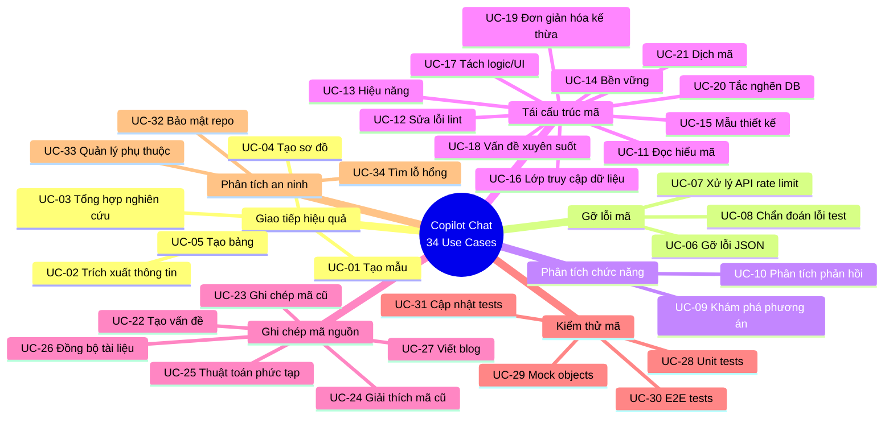
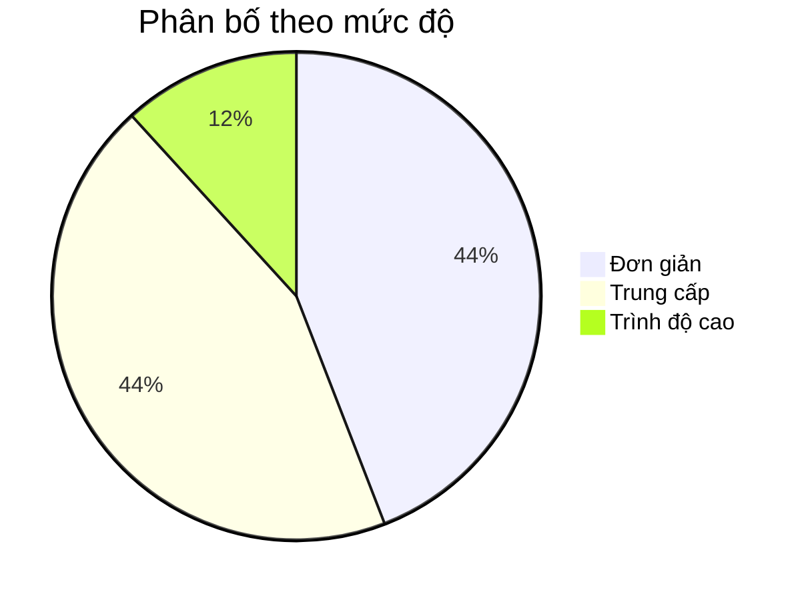
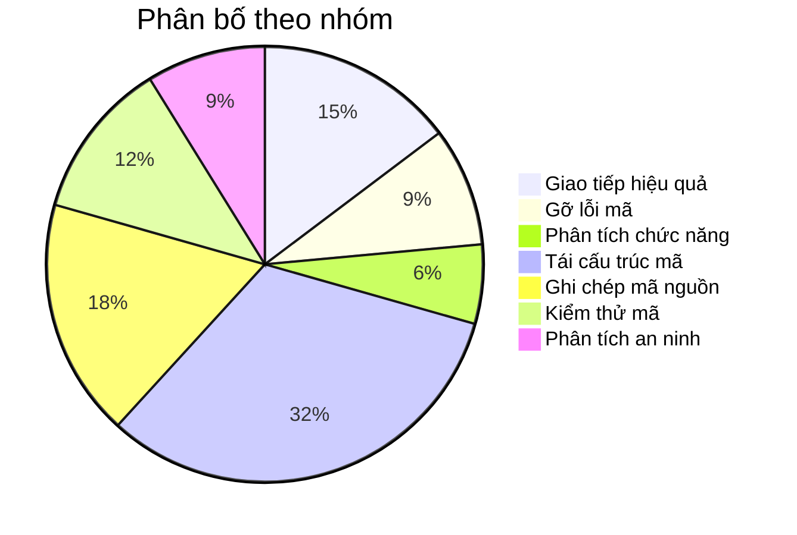

# Copilot Chat Use Cases - Tổng hợp

> Tài liệu tổng hợp 34 use cases của GitHub Copilot Chat, được tổ chức theo 7 nhóm kỹ năng và 3 mức độ phức tạp. Áp dụng cho dự án Workspace IDE (ATC-O48/Claude-OpenAI-Code) và Copilot CLI (ATC-O48/copilot-cli).

---

## Mục lục

- [Tổng quan](#tổng-quan)
- [Phân loại theo nhóm](#phân-loại-theo-nhóm)
  - [1. Giao tiếp hiệu quả (5 use cases)](#1-giao-tiếp-hiệu-quả)
  - [2. Gỡ lỗi mã (3 use cases)](#2-gỡ-lỗi-mã)
  - [3. Phân tích chức năng (2 use cases)](#3-phân-tích-chức-năng)
  - [4. Tái cấu trúc mã (11 use cases)](#4-tái-cấu-trúc-mã)
  - [5. Ghi chép mã nguồn (6 use cases)](#5-ghi-chép-mã-nguồn)
  - [6. Kiểm thử mã (4 use cases)](#6-kiểm-thử-mã)
  - [7. Phân tích an ninh (3 use cases)](#7-phân-tích-an-ninh)
- [Phân loại theo mức độ](#phân-loại-theo-mức-độ)
- [Sơ đồ tổng quan](#sơ-đồ-tổng-quan)
- [Tài liệu liên quan](#tài-liệu-liên-quan)

---

## Tổng quan

| Thống kê | Giá trị |
|----------|---------|
| Tổng số use cases | 34 |
| Nhóm kỹ năng | 7 |
| Mức độ Đơn giản | 15 |
| Mức độ Trung cấp | 15 |
| Mức độ Trình độ cao | 4 |

---

## Phân loại theo nhóm

### 1. Giao tiếp hiệu quả

Nhóm kỹ năng tập trung vào việc sử dụng Copilot Chat để tạo nội dung giao tiếp: templates, bảng biểu, sơ đồ, tổng hợp thông tin.

| # | Tên (Tiếng Việt) | Tên (English) | Mức độ | Tags |
|---|---|---|---|---|
| 1 | Tạo mẫu | Generate Templates | Đơn giản | `templates`, `documentation`, `productivity` |
| 2 | Trích xuất thông tin | Extract Information | Đơn giản | `extraction`, `analysis`, `summarization` |
| 3 | Tổng hợp nghiên cứu | Synthesize Research | Đơn giản | `research`, `synthesis`, `technical-writing` |
| 4 | Tạo sơ đồ | Create Diagrams | Đơn giản | `diagrams`, `mermaid`, `visualization` |
| 5 | Tạo bảng | Create Tables | Đơn giản | `tables`, `comparison`, `documentation` |

#### Chi tiết

**UC-01: Tạo mẫu (Generate Templates)**
- **Mức độ**: Đơn giản
- **Mô tả**: Sử dụng Copilot để tạo các template chuẩn cho PR, issue, contributing guidelines, hoặc cấu trúc file mới phù hợp với dự án.
- **Tags**: `templates`, `documentation`, `productivity`
- **Kỹ năng liên quan**: Technical writing, project management

**UC-02: Trích xuất thông tin (Extract Information)**
- **Mức độ**: Đơn giản
- **Mô tả**: Dùng Copilot để trích xuất và phân loại thông tin từ các file lớn (changelogs, logs, documentation) thành các mục có cấu trúc.
- **Tags**: `extraction`, `analysis`, `summarization`
- **Kỹ năng liên quan**: Data analysis, text processing

**UC-03: Tổng hợp nghiên cứu (Synthesize Research)**
- **Mức độ**: Đơn giản
- **Mô tả**: Tổng hợp thông tin từ nhiều nguồn (README, design docs, code) thành bản tóm tắt kỹ thuật có cấu trúc với điểm mạnh, điểm yếu, và đề xuất.
- **Tags**: `research`, `synthesis`, `technical-writing`
- **Kỹ năng liên quan**: Technical analysis, documentation

**UC-04: Tạo sơ đồ (Create Diagrams)**
- **Mức độ**: Đơn giản
- **Mô tả**: Yêu cầu Copilot tạo sơ đồ Mermaid mô tả kiến trúc, luồng dữ liệu, hoặc quan hệ giữa các component từ mã nguồn.
- **Tags**: `diagrams`, `mermaid`, `visualization`
- **Kỹ năng liên quan**: System design, architecture visualization

**UC-05: Tạo bảng (Create Tables)**
- **Mức độ**: Đơn giản
- **Mô tả**: Sử dụng Copilot để tạo bảng so sánh, bảng thống kê từ mã nguồn hoặc tài liệu hiện có.
- **Tags**: `tables`, `comparison`, `documentation`
- **Kỹ năng liên quan**: Data organization, technical writing

---

### 2. Gỡ lỗi mã

Nhóm kỹ năng tập trung vào việc sử dụng Copilot để tìm và sửa lỗi trong mã nguồn.

| # | Tên (Tiếng Việt) | Tên (English) | Mức độ | Tags |
|---|---|---|---|---|
| 6 | Gỡ lỗi JSON không hợp lệ | Debug Invalid JSON | Trung cấp | `debugging`, `json`, `validation` |
| 7 | Xử lý giới hạn tỷ lệ truy cập API | Handle API Rate Limits | Trung cấp | `api`, `rate-limiting`, `error-handling` |
| 8 | Chẩn đoán lỗi kiểm tra | Diagnose Test Failures | Trung cấp | `testing`, `debugging`, `diagnosis` |

#### Chi tiết

**UC-06: Gỡ lỗi JSON không hợp lệ (Debug Invalid JSON)**
- **Mức độ**: Trung cấp
- **Mô tả**: Sử dụng Copilot để kiểm tra cấu trúc JSON, xác minh tính hợp lệ của dữ liệu so với interface/schema, và phát hiện lỗi format.
- **Tags**: `debugging`, `json`, `validation`
- **Kỹ năng liên quan**: Data validation, type checking

**UC-07: Xử lý giới hạn tỷ lệ truy cập API (Handle API Rate Limits)**
- **Mức độ**: Trung cấp
- **Mô tả**: Yêu cầu Copilot viết logic xử lý rate limiting cho API calls bao gồm exponential backoff, retry mechanism, và UI feedback.
- **Tags**: `api`, `rate-limiting`, `error-handling`
- **Kỹ năng liên quan**: API design, error handling, UX

**UC-08: Chẩn đoán lỗi kiểm tra (Diagnose Test Failures)**
- **Mức độ**: Trung cấp
- **Mô tả**: Dùng Copilot để phân tích test failures, tìm root cause từ error messages, stack traces, và logic code liên quan.
- **Tags**: `testing`, `debugging`, `diagnosis`
- **Kỹ năng liên quan**: Test analysis, logical reasoning

---

### 3. Phân tích chức năng

Nhóm kỹ năng tập trung vào việc sử dụng Copilot để phân tích requirements và đề xuất giải pháp.

| # | Tên (Tiếng Việt) | Tên (English) | Mức độ | Tags |
|---|---|---|---|---|
| 9 | Khám phá phương án triển khai | Explore Feature Implementations | Trung cấp | `feature-design`, `comparison`, `architecture` |
| 10 | Phân tích phản hồi người dùng | Analyze User Feedback | Trung cấp | `feedback`, `prioritization`, `product` |

#### Chi tiết

**UC-09: Khám phá phương án triển khai (Explore Feature Implementations)**
- **Mức độ**: Trung cấp
- **Mô tả**: Yêu cầu Copilot đề xuất nhiều phương án triển khai cho một tính năng mới, so sánh ưu nhược điểm dựa trên context của dự án.
- **Tags**: `feature-design`, `comparison`, `architecture`
- **Kỹ năng liên quan**: System design, trade-off analysis

**UC-10: Phân tích phản hồi người dùng (Analyze User Feedback)**
- **Mức độ**: Trung cấp
- **Mô tả**: Sử dụng Copilot để phân tích feedback, review comments, hoặc design reviews và tạo danh sách ưu tiên theo impact/effort.
- **Tags**: `feedback`, `prioritization`, `product`
- **Kỹ năng liên quan**: Product thinking, prioritization

---

### 4. Tái cấu trúc mã

Nhóm kỹ năng lớn nhất, tập trung vào việc cải thiện chất lượng mã nguồn hiện có.

| # | Tên (Tiếng Việt) | Tên (English) | Mức độ | Tags |
|---|---|---|---|---|
| 11 | Cải thiện khả năng đọc hiểu mã | Improve Code Readability | Đơn giản | `readability`, `naming`, `comments` |
| 12 | Sửa lỗi lint | Fix Lint Errors | Trung cấp | `linting`, `code-quality`, `eslint` |
| 13 | Tái cấu trúc hiệu năng | Refactor for Performance | Đơn giản | `performance`, `memoization`, `optimization` |
| 14 | Tái cấu trúc bền vững | Refactor for Sustainability | Đơn giản | `css`, `modularity`, `maintainability` |
| 15 | Tái cấu trúc mẫu thiết kế | Refactor to Design Pattern | Trung cấp | `design-patterns`, `registry`, `strategy` |
| 16 | Tái cấu trúc lớp truy cập dữ liệu | Refactor Data Access Layers | Trình độ cao | `architecture`, `separation-of-concerns`, `services` |
| 17 | Tách logic nghiệp vụ khỏi UI | Decouple Business Logic from UI | Trình độ cao | `decoupling`, `hooks`, `clean-architecture` |
| 18 | Giải quyết vấn đề xuyên suốt | Address Cross-Cutting Concerns | Trung cấp | `cross-cutting`, `custom-hooks`, `reusability` |
| 19 | Đơn giản hóa kế thừa | Simplify Inheritance Hierarchies | Trung cấp | `types`, `type-guards`, `simplification` |
| 20 | Khắc phục tắc nghẽn DB | Fix Database Bottlenecks | Trình độ cao | `database`, `indexeddb`, `async`, `performance` |
| 21 | Dịch mã | Translate Code | Đơn giản | `translation`, `framework-migration`, `polyglot` |

#### Chi tiết

**UC-11: Cải thiện khả năng đọc hiểu mã (Improve Code Readability)**
- **Mức độ**: Đơn giản
- **Mô tả**: Yêu cầu Copilot cải thiện tên biến, thêm comments, tách logic phức tạp thành các hàm nhỏ hơn với tên rõ ràng.
- **Tags**: `readability`, `naming`, `comments`
- **Kỹ năng liên quan**: Clean code, naming conventions

**UC-12: Sửa lỗi lint (Fix Lint Errors)**
- **Mức độ**: Trung cấp
- **Mô tả**: Dùng Copilot để phân tích và sửa các lỗi ESLint, bao gồm unused variables, missing dependencies, và style violations.
- **Tags**: `linting`, `code-quality`, `eslint`
- **Kỹ năng liên quan**: Code standards, static analysis

**UC-13: Tái cấu trúc hiệu năng (Refactor for Performance)**
- **Mức độ**: Đơn giản
- **Mô tả**: Yêu cầu Copilot tối ưu performance: memoization, debounce, virtualization, lazy loading cho các component render nhiều.
- **Tags**: `performance`, `memoization`, `optimization`
- **Kỹ năng liên quan**: React optimization, profiling

**UC-14: Tái cấu trúc bền vững (Refactor for Sustainability)**
- **Mức độ**: Đơn giản
- **Mô tả**: Sử dụng Copilot để tách file CSS monolithic thành modules, loại bỏ code không sử dụng, và cải thiện maintainability.
- **Tags**: `css`, `modularity`, `maintainability`
- **Kỹ năng liên quan**: CSS architecture, code organization

**UC-15: Tái cấu trúc mẫu thiết kế (Refactor to Design Pattern)**
- **Mức độ**: Trung cấp
- **Mô tả**: Yêu cầu Copilot refactor code từ switch-case hoặc if-else chains sang design patterns (Registry, Strategy, Factory) phù hợp.
- **Tags**: `design-patterns`, `registry`, `strategy`
- **Kỹ năng liên quan**: Design patterns, SOLID principles

**UC-16: Tái cấu trúc lớp truy cập dữ liệu (Refactor Data Access Layers)**
- **Mức độ**: Trình độ cao
- **Mô tả**: Dùng Copilot để tách data access logic ra khỏi business logic, tạo service layers riêng biệt cho file system operations.
- **Tags**: `architecture`, `separation-of-concerns`, `services`
- **Kỹ năng liên quan**: Clean architecture, service layer pattern

**UC-17: Tách logic nghiệp vụ khỏi UI (Decouple Business Logic from UI)**
- **Mức độ**: Trình độ cao
- **Mô tả**: Yêu cầu Copilot tách business logic ra khỏi React components bằng custom hooks, giữ components chỉ làm nhiệm vụ render UI.
- **Tags**: `decoupling`, `hooks`, `clean-architecture`
- **Kỹ năng liên quan**: React patterns, separation of concerns

**UC-18: Giải quyết vấn đề xuyên suốt (Address Cross-Cutting Concerns)**
- **Mức độ**: Trung cấp
- **Mô tả**: Sử dụng Copilot để xác định logic lặp lại giữa nhiều components và tạo shared utilities/hooks để tái sử dụng.
- **Tags**: `cross-cutting`, `custom-hooks`, `reusability`
- **Kỹ năng liên quan**: DRY principle, abstraction

**UC-19: Đơn giản hóa kế thừa (Simplify Inheritance Hierarchies)**
- **Mức độ**: Trung cấp
- **Mô tả**: Yêu cầu Copilot đơn giản hóa type hierarchies bằng type aliases, type guards, và discriminated unions.
- **Tags**: `types`, `type-guards`, `simplification`
- **Kỹ năng liên quan**: TypeScript advanced types, type safety

**UC-20: Khắc phục tắc nghẽn DB (Fix Database Bottlenecks)**
- **Mức độ**: Trình độ cao
- **Mô tả**: Dùng Copilot để đề xuất cách migrate từ in-memory state sang persistent storage (IndexedDB/localStorage) mà không block UI thread.
- **Tags**: `database`, `indexeddb`, `async`, `performance`
- **Kỹ năng liên quan**: Web APIs, async programming, Web Workers

**UC-21: Dịch mã (Translate Code)**
- **Mức độ**: Đơn giản
- **Mô tả**: Sử dụng Copilot để dịch code từ một framework/ngôn ngữ sang framework/ngôn ngữ khác, giữ nguyên chức năng.
- **Tags**: `translation`, `framework-migration`, `polyglot`
- **Kỹ năng liên quan**: Multi-framework knowledge, API mapping

---

### 5. Ghi chép mã nguồn

Nhóm kỹ năng tập trung vào việc tạo và cập nhật documentation cho mã nguồn.

| # | Tên (Tiếng Việt) | Tên (English) | Mức độ | Tags |
|---|---|---|---|---|
| 22 | Tạo vấn đề | Create Issues | Đơn giản | `issues`, `project-management`, `github` |
| 23 | Ghi chép mã nguồn cũ | Document Legacy Code | Đơn giản | `documentation`, `jsdoc`, `legacy` |
| 24 | Giải thích mã nguồn cũ | Explain Legacy Code | Đơn giản | `explanation`, `code-review`, `onboarding` |
| 25 | Giải thích thuật toán phức tạp | Explain Complex Algorithms | Trung cấp | `algorithms`, `recursion`, `explanation` |
| 26 | Đồng bộ tài liệu | Sync Documentation | Trung cấp | `documentation`, `sync`, `maintenance` |
| 27 | Viết bài blog/thảo luận | Write Blog Posts | Đơn giản | `blog`, `technical-writing`, `knowledge-sharing` |

#### Chi tiết

**UC-22: Tạo vấn đề (Create Issues)**
- **Mức độ**: Đơn giản
- **Mô tả**: Yêu cầu Copilot tạo GitHub issues có cấu trúc từ design reviews, bug reports, hoặc feature requests.
- **Tags**: `issues`, `project-management`, `github`
- **Kỹ năng liên quan**: Project management, issue tracking

**UC-23: Ghi chép mã nguồn cũ (Document Legacy Code)**
- **Mức độ**: Đơn giản
- **Mô tả**: Dùng Copilot để thêm JSDoc, type annotations, và inline comments cho code chưa có documentation.
- **Tags**: `documentation`, `jsdoc`, `legacy`
- **Kỹ năng liên quan**: Technical writing, code documentation

**UC-24: Giải thích mã nguồn cũ (Explain Legacy Code)**
- **Mức độ**: Đơn giản
- **Mô tả**: Sử dụng Copilot để giải thích chức năng, logic, và dependencies của code phức tạp cho team members mới.
- **Tags**: `explanation`, `code-review`, `onboarding`
- **Kỹ năng liên quan**: Knowledge transfer, mentoring

**UC-25: Giải thích thuật toán phức tạp (Explain Complex Algorithms)**
- **Mức độ**: Trung cấp
- **Mô tả**: Yêu cầu Copilot giải thích chi tiết các thuật toán phức tạp: recursive algorithms, tree traversal, dynamic programming trong codebase.
- **Tags**: `algorithms`, `recursion`, `explanation`
- **Kỹ năng liên quan**: Algorithm analysis, CS fundamentals

**UC-26: Đồng bộ tài liệu (Sync Documentation)**
- **Mức độ**: Trung cấp
- **Mô tả**: Dùng Copilot để so sánh documentation hiện có với mã nguồn, phát hiện phần outdated, và đề xuất cập nhật.
- **Tags**: `documentation`, `sync`, `maintenance`
- **Kỹ năng liên quan**: Documentation maintenance, consistency

**UC-27: Viết bài blog/thảo luận (Write Blog Posts)**
- **Mức độ**: Đơn giản
- **Mô tả**: Sử dụng Copilot để viết bài blog kỹ thuật, tutorials, hoặc case studies dựa trên code và kinh nghiệm trong dự án.
- **Tags**: `blog`, `technical-writing`, `knowledge-sharing`
- **Kỹ năng liên quan**: Content creation, storytelling

---

### 6. Kiểm thử mã

Nhóm kỹ năng tập trung vào việc tạo và quản lý test suites.

| # | Tên (Tiếng Việt) | Tên (English) | Mức độ | Tags |
|---|---|---|---|---|
| 28 | Tạo bài kiểm tra đơn vị | Generate Unit Tests | Trung cấp | `unit-testing`, `vitest`, `coverage` |
| 29 | Tạo đối tượng giả | Create Mock Objects | Trung cấp | `mocking`, `test-doubles`, `zustand` |
| 30 | Tạo kiểm tra E2E | Create E2E Tests | Trình độ cao | `e2e`, `playwright`, `integration` |
| 31 | Cập nhật bài kiểm thử | Update Unit Tests | Trung cấp | `test-maintenance`, `refactoring`, `coverage` |

#### Chi tiết

**UC-28: Tạo bài kiểm tra đơn vị (Generate Unit Tests)**
- **Mức độ**: Trung cấp
- **Mô tả**: Yêu cầu Copilot tạo unit tests cho store actions, utility functions, và component logic sử dụng testing framework của dự án.
- **Tags**: `unit-testing`, `vitest`, `coverage`
- **Kỹ năng liên quan**: Test design, assertion patterns

**UC-29: Tạo đối tượng giả (Create Mock Objects)**
- **Mức độ**: Trung cấp
- **Mô tả**: Dùng Copilot để tạo mock factories cho Zustand stores, API responses, và complex data structures cho testing.
- **Tags**: `mocking`, `test-doubles`, `zustand`
- **Kỹ năng liên quan**: Test architecture, dependency injection

**UC-30: Tạo kiểm tra E2E (Create E2E Tests)**
- **Mức độ**: Trình độ cao
- **Mô tả**: Sử dụng Copilot để tạo end-to-end test suites với Playwright, bao gồm user flows, assertions, và test fixtures.
- **Tags**: `e2e`, `playwright`, `integration`
- **Kỹ năng liên quan**: E2E testing, browser automation

**UC-31: Cập nhật bài kiểm thử (Update Unit Tests)**
- **Mức độ**: Trung cấp
- **Mô tả**: Yêu cầu Copilot cập nhật existing tests sau khi refactor code, đảm bảo coverage không giảm và tests phản ánh API mới.
- **Tags**: `test-maintenance`, `refactoring`, `coverage`
- **Kỹ năng liên quan**: Test evolution, regression prevention

---

### 7. Phân tích an ninh

Nhóm kỹ năng tập trung vào việc tìm và khắc phục các lỗ hổng bảo mật.

| # | Tên (Tiếng Việt) | Tên (English) | Mức độ | Tags |
|---|---|---|---|---|
| 32 | Bảo mật kho lưu trữ | Secure Repository | Đơn giản | `security`, `dependabot`, `policies` |
| 33 | Quản lý phụ thuộc | Manage Dependencies | Đơn giản | `dependencies`, `npm`, `vulnerability` |
| 34 | Tìm lỗ hổng bảo mật | Find Security Vulnerabilities | Trung cấp | `security-audit`, `xss`, `injection` |

#### Chi tiết

**UC-32: Bảo mật kho lưu trữ (Secure Repository)**
- **Mức độ**: Đơn giản
- **Mô tả**: Dùng Copilot để tạo các file bảo mật chuẩn: Dependabot config, SECURITY.md, CODEOWNERS, và branch protection rules.
- **Tags**: `security`, `dependabot`, `policies`
- **Kỹ năng liên quan**: DevSecOps, repository management

**UC-33: Quản lý phụ thuộc (Manage Dependencies)**
- **Mức độ**: Đơn giản
- **Mô tả**: Sử dụng Copilot để phân tích dependencies: kiểm tra phiên bản, tìm packages deprecated, đề xuất cập nhật an toàn.
- **Tags**: `dependencies`, `npm`, `vulnerability`
- **Kỹ năng liên quan**: Package management, supply chain security

**UC-34: Tìm lỗ hổng bảo mật (Find Security Vulnerabilities)**
- **Mức độ**: Trung cấp
- **Mô tả**: Yêu cầu Copilot kiểm tra code cho các lỗ hổng: XSS, injection, insecure data handling, missing error boundaries.
- **Tags**: `security-audit`, `xss`, `injection`
- **Kỹ năng liên quan**: Application security, OWASP

---

## Phân loại theo mức độ

### Đơn giản (15 use cases)

Phù hợp cho người mới bắt đầu sử dụng Copilot Chat.

| # | Use Case | Nhóm |
|---|---|---|
| 1 | Tạo mẫu (Generate Templates) | Giao tiếp hiệu quả |
| 2 | Trích xuất thông tin (Extract Information) | Giao tiếp hiệu quả |
| 3 | Tổng hợp nghiên cứu (Synthesize Research) | Giao tiếp hiệu quả |
| 4 | Tạo sơ đồ (Create Diagrams) | Giao tiếp hiệu quả |
| 5 | Tạo bảng (Create Tables) | Giao tiếp hiệu quả |
| 11 | Cải thiện khả năng đọc hiểu mã (Improve Code Readability) | Tái cấu trúc mã |
| 13 | Tái cấu trúc hiệu năng (Refactor for Performance) | Tái cấu trúc mã |
| 14 | Tái cấu trúc bền vững (Refactor for Sustainability) | Tái cấu trúc mã |
| 21 | Dịch mã (Translate Code) | Tái cấu trúc mã |
| 22 | Tạo vấn đề (Create Issues) | Ghi chép mã nguồn |
| 23 | Ghi chép mã nguồn cũ (Document Legacy Code) | Ghi chép mã nguồn |
| 24 | Giải thích mã nguồn cũ (Explain Legacy Code) | Ghi chép mã nguồn |
| 27 | Viết bài blog/thảo luận (Write Blog Posts) | Ghi chép mã nguồn |
| 32 | Bảo mật kho lưu trữ (Secure Repository) | Phân tích an ninh |
| 33 | Quản lý phụ thuộc (Manage Dependencies) | Phân tích an ninh |

### Trung cấp (15 use cases)

Yêu cầu hiểu biết về cấu trúc dự án và patterns.

| # | Use Case | Nhóm |
|---|---|---|
| 6 | Gỡ lỗi JSON không hợp lệ (Debug Invalid JSON) | Gỡ lỗi mã |
| 7 | Xử lý giới hạn tỷ lệ truy cập API (Handle API Rate Limits) | Gỡ lỗi mã |
| 8 | Chẩn đoán lỗi kiểm tra (Diagnose Test Failures) | Gỡ lỗi mã |
| 9 | Khám phá phương án triển khai (Explore Feature Implementations) | Phân tích chức năng |
| 10 | Phân tích phản hồi người dùng (Analyze User Feedback) | Phân tích chức năng |
| 12 | Sửa lỗi lint (Fix Lint Errors) | Tái cấu trúc mã |
| 15 | Tái cấu trúc mẫu thiết kế (Refactor to Design Pattern) | Tái cấu trúc mã |
| 18 | Giải quyết vấn đề xuyên suốt (Address Cross-Cutting Concerns) | Tái cấu trúc mã |
| 19 | Đơn giản hóa kế thừa (Simplify Inheritance Hierarchies) | Tái cấu trúc mã |
| 25 | Giải thích thuật toán phức tạp (Explain Complex Algorithms) | Ghi chép mã nguồn |
| 26 | Đồng bộ tài liệu (Sync Documentation) | Ghi chép mã nguồn |
| 28 | Tạo bài kiểm tra đơn vị (Generate Unit Tests) | Kiểm thử mã |
| 29 | Tạo đối tượng giả (Create Mock Objects) | Kiểm thử mã |
| 31 | Cập nhật bài kiểm thử (Update Unit Tests) | Kiểm thử mã |
| 34 | Tìm lỗ hổng bảo mật (Find Security Vulnerabilities) | Phân tích an ninh |

### Trình độ cao (4 use cases)

Yêu cầu kiến thức sâu về architecture và system design.

| # | Use Case | Nhóm |
|---|---|---|
| 16 | Tái cấu trúc lớp truy cập dữ liệu (Refactor Data Access Layers) | Tái cấu trúc mã |
| 17 | Tách logic nghiệp vụ khỏi UI (Decouple Business Logic from UI) | Tái cấu trúc mã |
| 20 | Khắc phục tắc nghẽn DB (Fix Database Bottlenecks) | Tái cấu trúc mã |
| 30 | Tạo kiểm tra E2E (Create E2E Tests) | Kiểm thử mã |

---

## Sơ đồ tổng quan

---

## Tài liệu liên quan

| File | Mô tả |
|------|--------|
| [COPILOT_CODE_MAPPING.md](./COPILOT_CODE_MAPPING.md) | Ánh xạ chi tiết từng use case vào mã nguồn cụ thể |
| [COPILOT_PROMPT_TEMPLATES.md](./COPILOT_PROMPT_TEMPLATES.md) | 34 prompt templates cho từng use case |
| [DESIGN_REVIEW.md](./DESIGN_REVIEW.md) | Đánh giá thiết kế dự án Workspace IDE |

---

*Tài liệu được tạo cho dự án Workspace IDE — ATC-O48/Claude-OpenAI-Code*
