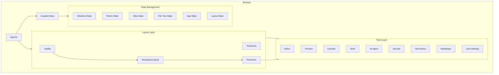
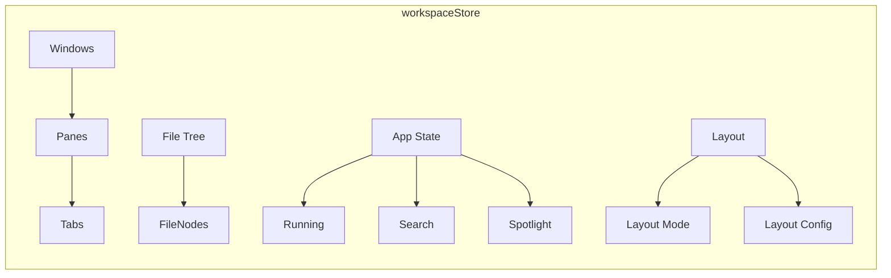

# Workspace IDE — Documentation

Comprehensive documentation for the Workspace IDE project.

---

## Architecture Overview

### Core Concepts

| Concept | Description |
|---------|-------------|
| **Workspace** | Top-level container for the entire IDE session |
| **Window** | A browser window containing a layout tree |
| **PaneSplit** | Recursive container for horizontal/vertical tiling |
| **Pane** | Terminal layout node containing one or more tabs |
| **Tab** | An instance of a tool (Editor, Shell, Preview, etc.) |
| **Tool** | A functional component registered in the ToolRenderer |
| **LayoutNode** | Recursive tree structure defining the visual grid |
| **FileNode** | Virtual file system unit (file or folder) |

---

## Getting Started

| Goal | Resource |
|------|----------|
| Run the project locally | [Main README — Getting Started](../README.md#-getting-started) |
| Understand the codebase | [Code Mapping](COPILOT_CODE_MAPPING.md) |
| Contribute to the project | [Contributing Guide](../CONTRIBUTING.md) |
| Report a security issue | [Security Policy](../SECURITY.md) |

---

## Documentation Index

### Architecture

| Document | Description |
|----------|-------------|
| [Design Review](DESIGN_REVIEW.md) | Technical design review covering component architecture, state management patterns, and layout system design decisions |
| [Code Mapping](COPILOT_CODE_MAPPING.md) | Comprehensive codebase structure reference mapping every component, store, and utility to its role |

### Guides

| Document | Description |
|----------|-------------|
| [Layout System](KITTY_LAYOUTS.md) | Detailed documentation of the 7 kitty-inspired layout modes (Stack, Tall, Fat, Grid, Splits, Horizontal, Vertical) including configuration and keyboard shortcuts |
| [Use Cases](COPILOT_USECASES.md) | Feature use cases and developer workflows covering real-world scenarios |

### Reference

| Document | Description |
|----------|-------------|
| [Prompt Templates](COPILOT_PROMPT_TEMPLATES.md) | AI prompt templates for code generation, debugging, and development assistance |
| [Contributing](../CONTRIBUTING.md) | Development setup, code style guidelines, and PR process |
| [Security](../SECURITY.md) | Vulnerability reporting policy and supported versions |

---

## State Management

The IDE uses **Zustand** for centralized state management. The store (`src/stores/workspaceStore.ts`) manages:

| State Slice | Responsibilities |
|-------------|-----------------|
| **Windows** | Window CRUD, active window tracking |
| **Panes** | Splitting, floating, maximizing, docking |
| **Tabs** | Adding, removing, moving between panes |
| **File Tree** | File/folder CRUD, expand/collapse |
| **App State** | Running status, search, spotlight |
| **Layout** | Layout mode selection, bias, mirroring |

---

## Layout System

The IDE supports 7 layout modes inspired by the [kitty terminal emulator](https://sw.kovidgoyal.net/kitty/):

| Layout | Description |
|--------|-------------|
| **Stack** | Single visible pane with tab bar for switching |
| **Tall** | Main pane on left, others stacked right |
| **Fat** | Main pane on top, others arranged below |
| **Grid** | Equal-size grid arrangement |
| **Splits** | Free-form horizontal/vertical splits |
| **Horizontal** | All panes in a single row |
| **Vertical** | All panes in a single column |

> For detailed layout documentation, see [KITTY_LAYOUTS.md](KITTY_LAYOUTS.md).

---

[Back to Main README](../README.md)

